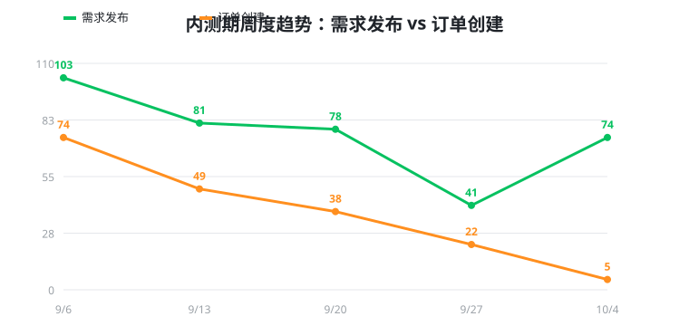
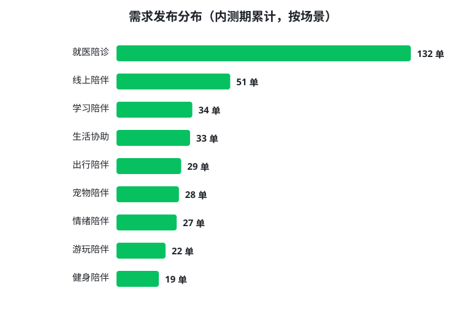
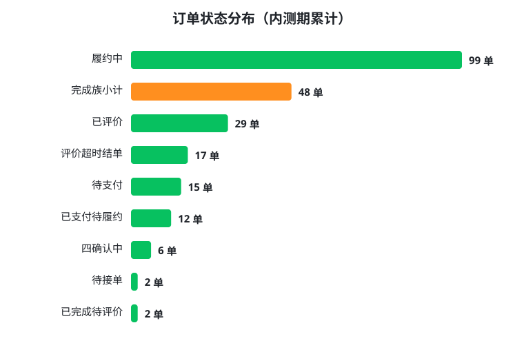
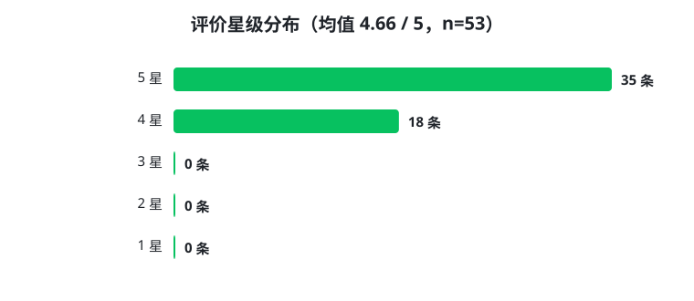
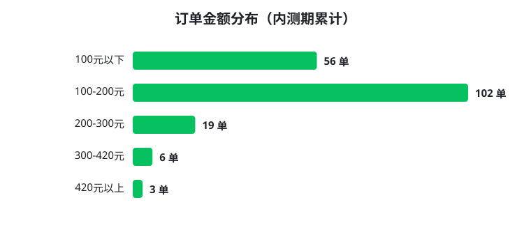

# 「找个人帮忙」生活协助服务撮合平台
# 商业计划书（详尽版）

- 版本：V1.1（2026-10-06，V1.0 同日迭代：深化财务模型/竞品推演/单位经济）
- 产品形态：微信原生小程序 + 腾讯云开发（CloudBase）
- AppID：wxbc4a4afacdf234f5
- 云环境：cloud1-d9gkefwcp5c777088
- 当前阶段：MVP 测试版（内测 / 提审准备中）
- 文档性质：内部经营与融资沟通文件。文中标注「假设」「测算」的数据为规划模型，非历史既成事实。

---

## 目录

1. 执行摘要
2. 市场背景与用户痛点
3. 产品与服务
4. 商业模式与盈利分析
5. 目标市场与规模测算（TAM/SAM/SOM）
6. 竞争分析与差异化
7. 运营与增长策略
8. 技术与产品架构
9. 合规、安全与风险控制
10. 团队与组织
11. 财务预测（三年模型）
12. 发展里程碑与融资计划
13. 附录：数据口径、术语与真实业务规则

---

## 1. 执行摘要

### 1.1 一句话定位

「找个人帮忙」是微信生态内第一个以**安全与信任为核心架构**的非标生活协助撮合平台：有陪诊、代办、搭子、陪伴需求的发单人，在平台上匹配经过实名认证与场景考核的个人服务者（耍伴），并在平台内完成「匹配 → 四确认 → 担保支付 → 履约 → 评价 → 结算」全闭环。

**投资亮点速览：**

1. **被主流供给共同遗漏的中间市场**：非医疗、非运输、非家政的「陪伴型协助」，客单 100–400 元，巨头不愿做、家政做不了、分类信息做不好——我们用一个平台统一承接 9 个场景。
2. **信任即产品**：四确认机制、信用分、夜间红线、场景化免责文本、平台赠险——安全不是客服话术，而是写进状态机的产品架构，构成难以复制的合规壁垒。
3. **供给侧经济学极健康**：耍伴单月实收约 2,500 元（时薪 40–50 元），供给 CAC 回收期 < 1 个月；用户与耍伴同账号体系，双边获客成本接近单边。
4. **已可运行、非 PPT 项目**：全链路 MVP 已在内测环境完整跑通（197 单、756 条状态流水、53 条评价），质量与备份机制制度化，距正式上线只差三项平台资质申请。
5. **轻资产 + 极低试错成本**：云开发原生架构，单人 + AI 工程化即完成交付；单位经济边际贡献率约 80%，盈亏平衡仅需单城月订单 0.9–1.0 万单。

### 1.2 我们解决的核心矛盾

中国城市生活中存在大量「一个人搞不定、找朋友欠人情、找专业机构太贵或不对口」的碎片化协助需求：一个人看病想有人陪诊排队、健身需要人保护与督促、想去博物馆但没人同行、晚上跑步想要个搭子、情绪低落想找人在公共场所聊聊、出差时需要人帮忙喂猫遛狗。

这些需求的共性是：**非标准化、低客单、高情感属性、强调安全与信任**。传统家政公司覆盖不了（太重、太贵、不供给这类「陪伴型」人力），纯信息分类平台（58、闲鱼）解决不了信任与履约，即时配送平台（美团跑腿、闪送）只送物不陪人。

### 1.3 解决方案要点

- **9 大生活协助场景**：就医陪诊、学习陪伴、健身陪伴、游玩陪伴、情绪陪伴、生活协助、宠物陪伴、出行陪伴、线上陪伴，覆盖线下公共场所与线上两类供给。
- **双角色同一账号体系**：用户与耍伴身份可切换，降低供给侧获客成本（需求方也能成为服务方）。
- **结构化「四确认」机制**：时间、地点、内容、费用四项由双方逐项确认后方可支付，把口头纠纷前置消灭。
- **安全与信任基础设施**：实名认证 + 紧急联系人 + 场景准入考核 + 信用分（L1–L4）+ 平台赠送意外险 + 夜间红线（00:00–06:00 禁约禁履约）+ 一键 SOS + 九套场景化免责法律文本。
- **资金闭环**：担保交易、平台抽佣、服务完成后 T+1 结算、新耍伴极速提现、打赏激励。
- **轻资产技术架构**：原生小程序 + 云开发，20+ 云函数支撑全部业务，当前以极小团队即完成可内测的完整 MVP。

### 1.4 当前进展（真实数据，截至 2026-10-06）

| 维度 | 现状 |
|---|---|
| 产品完成度 | 全链路可跑：发布 → 匹配/抢单 → 四确认 → 模拟支付 → 履约里程碑 → 完成评价 → 分账结算 → 提现 → 售后投诉/改期/加时 |
| 内测数据（测试库） | 注册账号 29；耍伴档案 5；需求累计 722；订单 197；状态流水 756；评价 53；IM 消息 510 |
| 场景 | 9 个场景全部配置上线（含 27 个标准子场景选项） |
| 支付 | 模拟支付闭环完成；真实微信支付三件套（支付回调验签 / 交易幂等 / 对账）已完成设计，待商户号 |
| 城市 | 已开通：成都、重庆（配置可热更新扩城） |
| 质量机制 | 回归基线清单 + 网关自动化冒烟 + 三重数据备份（git bundle / 热备 / 云端导出）已制度化 |
| 上线阻塞项 | ① 微信支付商户号；② 陪诊类目资质；③ 隐私保护指引表单（均为平台侧申请事项） |


*图 1-1 内测期真实后台数据：需求发布与订单创建周度趋势（数据源：2026-10-05 云端数据库全量导出）*

### 1.5 财务概要（基准情形，测算）

- 收入模型：交易佣金（当前费率 **10%**）为主，打赏当前 100% 归耍伴（供给激励，不抽成），中期叠加保险、会员、增值曝光。
- 单位经济：基准客单价 220 元，单均平台佣金 22 元；履约+支付+保险+云资源的边际成本约 3–5 元/单，边际贡献率约 80%。
- 盈亏平衡：单城口径月订单约 0.9–1.0 万单（月 GMV 约 200–220 万元）；集团口径（含多城固定成本与扩张补贴）约 1.6–2.0 万单/月，基准情形下 2028 年初跨越。
- 融资需求：种子轮 100–200 万元，跑道 12–18 个月，用于资质合规、双城验证、供给侧冷启动与小团队搭建。

---

## 2. 市场背景与用户痛点

### 2.1 宏观趋势

1. **独居与小型家庭化**：中国一人户家庭已超过 1.25 亿户（第七次人口普查口径），年轻人独居、异地工作、老龄化叠加，「身边没人帮忙」成为普遍城市状态。
2. **情绪价值付费崛起**：陪伴型消费（搭子社交、游戏陪玩、树洞倾听、宠物经济）持续高增长，用户为「在场感」和「被回应」付费的习惯已被教育成熟。
3. **老龄化与陪诊刚需**：60 岁以上人口超过 3 亿，异地子女为父母购买陪诊、代取药服务的需求快速显性化。
4. **零工供给侧成熟**：灵活就业人群规模庞大，大学生、自由职业者、健身教练、护理专业学生有强烈的碎片时间变现意愿。
5. **微信生态基础设施完备**：小程序 + 微信支付 + 订阅消息 + 实名能力，使 C2C 撮合 + 担保交易可以极低获客与技术成本启动。

### 2.2 用户画像

**发单侧（需求方）：**

| 人群 | 典型场景 | 付费动机 |
|---|---|---|
| 22–35 岁独居青年 | 搭子、健身、游玩、情绪、线上陪伴 | 情感价值、安全陪伴、懒得欠人情 |
| 异地子女（为父母下单） | 就医陪诊、取药送药 | 尽孝、专业流程协助、过程可视 |
| 本地中老年本人 | 陪诊、生活代办 | 不会用医院设备、需要有人跑流程 |
| 养宠人群 | 遛狗、喂猫、陪同就医 | 出差/加班时的刚性托管协助 |
| 学生 / 家长 | 自习陪伴、口语陪练、作业督促 | 监督与陪伴，非学科培训，合规 |

**耍伴侧（供给方）：**

| 人群 | 供给场景 | 动机 |
|---|---|---|
| 医学/护理专业学生 | 陪诊 W1 | 兼职收入 + 相关履历 |
| 体育院校学生、健身爱好者/教练 | 健身 W3、出行 W10 | 时薪变现 |
| 大学生 | 学习 W2、游玩 W4、线上 W11 | 灵活、门槛友好 |
| 自由职业者 | 生活协助 W8、情绪 W7 | 填补碎片时间 |
| 宠物爱好者 | 宠物 W9 | 兴趣变现 |

### 2.3 现有解决方案的不足（痛点矩阵）

| 现有方式 | 痛点 |
|---|---|
| 找亲友帮忙 | 欠人情、时间难凑、无法标准化、专业场景帮不上 |
| 家政/陪诊公司 | 客单价高（陪诊常 300–800 元/次）、预约重、只覆盖少数场景、供给不足 |
| 58/闲鱼等分类信息 | 无身份核验、无担保交易、无履约标准、纠纷无平台介入、隐私裸奔 |
| 跑腿平台（美团跑腿/闪送） | 只送物不陪人，无陪伴型供给与流程设计 |
| 游戏陪玩平台（比心等） | 仅限线上娱乐，无线下生活场景与安全体系 |
| 私下微信群/豆瓣搭子组 | 匹配效率极低、无信任背书、爽约率高、资金与安全无保障 |

**结论**：「非医疗、非运输、非标陪伴型生活协助」是一个被主流供给方共同遗漏的中间地带，且微信生态内尚无以「安全信任 + 担保交易 + 结构化确认」为核心的专门平台。

---

## 3. 产品与服务

### 3.1 九大业务场景（与线上线下配置完全一致）

| 代码 | 场景 | 标准子场景 | 交付场所 | 特别合规设计 |
|---|---|---|---|---|
| W1 | 就医陪诊 | 挂号排队 / 取药送药 / 陪诊解压 | 医院等公共场所 | 医疗边界免责声明；明确非诊疗、不用药建议 |
| W2 | 学习陪伴 | 自习陪伴 / 口语陪练 / 作业督促 | 图书馆、书店等公共场所 | 非学科培训声明；未成年人须监护人同意；可选 AA 记账 |
| W3 | 健身陪伴 | 健身指导 / 跑步陪跑 / 器械陪同 | 健身房、绿道 | 非专业训练指导声明；健康告知义务 |
| W4 | 游玩陪伴 | 景区游览 / 博物馆参观 / 商圈逛街 | 公开景区/场馆/商圈 | 禁止进入私密空间；第三方费用自理 |
| W7 | 情绪陪伴 | 陪伴散步 / 倾听陪伴 / 考前鼓励 | 公共场所 | 非心理咨询声明；危机干预引导（120/110/心理援助热线） |
| W8 | 生活协助 | 排队代办 / 搬家帮手 / 采买陪同 | 公共场所 | 禁高空作业、危险品、电器维修等需资质项 |
| W9 | 宠物陪伴 | 遛狗陪伴 / 喂猫照料 / 宠物就医陪同 | 户外/宠物医院 | 非兽医声明；电子宠物照料授权书；禁上门寄养 |
| W10 | 出行陪伴 | 逛街同行 / 夜跑陪跑 / 活动搭子 | 公共场所 | 非承运人责任；夜间安全提示与紧急联系人 |
| W11 | 线上陪伴 | 树洞倾听 / 游戏陪玩 / 打卡监督 | 线上 | 禁止金钱往来与敏感信息索取；内容安全审核 |


*图 3-1 内测期需求发布真实分布：9 场景均有真实订单产生，验证多场景统一撮合的产品假设*

### 3.2 核心交易流程（已全部实现）

```
发单：选场景 → 结构化表单(时间/地点/内容/人数/时长/预算) → 敏感词校验 → 发布(matching)
匹配：广场/附近/首页推荐(距离+场景+信用) → 耍伴抢单(防重入锁 + CAS + 幂等捞回)
确认：时间/地点/内容/费用「四确认」双方逐项勾选(支持一键确认) → 免责声明签署
支付：担保支付(当前 mock，接入微信支付后为真实担保交易)
履约：到达提醒 → 开始 → 里程碑打卡 → 改期/加时(双方确认,夜间红线约束) → 完成
结算：双方互评 → 分账(平台抽佣 10%, 耍伴实收, 公益单有补贴) → T+1 可提现 / 新耍伴极速 T+0
售后：48 小时评价窗口、15 天售后投诉窗口、改期/中断/争议处理
```

### 3.3 信任与安全体系（核心壁垒）


*图 3-2 内测期订单状态真实分布：完成族（S5/S8/S9/S10）占比过半，全状态机在真实使用中被验证*

1. **身份与准入**：微信 openid + 手机号 + 实名认证（前端脱敏展示）；耍伴须填紧急联系人并通过场景准入考试（题库制，如陪诊/宠物场景）。
2. **信用分体系**：初始与行为驱动，L1–L4 四级（700/800/900 阈值）；下单/抢单均设信用门槛（当前 600 分）；低分到 400 触发冻结。
3. **资金安全**：担保交易、状态机驱动结算、写操作不重试防重复扣款、交易流水幂等、提现串行锁防并发双花、极速提现单笔 200 元/单日 2000 元限额。
4. **人身安全**：平台赠送意外险（身故/伤残保额 50 万、财产 5 万，保费平台承担）；一键 SOS 安全报备；紧急联系人；IM 与位置留痕。
5. **时间红线**：00:00–06:00 全域禁止预约与履约（参数化：open=360/close=1440 分钟），从系统层面消解最高风险时段。
6. **空间红线**：多场景免责文本统一要求「公共场所交付」，禁止进入住宅、酒店、私密包间（W9 亦禁上门寄养）。
7. **内容与隐私**：敏感词库（加微信/转账/私聊我等防跳单）、未成年人保护、隐私政策与用户协议内嵌确认、字段级脱敏（手机 138****1234）。
8. **九套场景化法律文本**：通用免责 + 8 个专项免责 + 隐私政策 + 服务协议 + AA 承诺书 + 宠物授权书，全部可后台热更新。


*图 3-3 内测期评价真实分布：高星级为主，评价与信用体系运转正常*

### 3.4 产品功能版图

- **用户端**：首页（场景入口+活动）、广场（需求流）、附近（地图/列表）、发布、需求详情、订单详情、支付、聊天（IM + 订单卡片 + 四确认）、评价、投诉。
- **耍伴端**：身份切换、接单工作台、接单配置（日常位置/可接场景/距离）、收益钱包（接单收入/打赏双专栏、时间段查询、提现）、入驻申请、考试、信用。
- **平台端（admin-web）**：用户/耍伴/需求/订单/财务管理、admin_config 热更新（场景、费率、红线、开关、活动、法律文本）、种子与运维工具。
- **系统能力**：站内通知中心 + 订单动态实时轮询（详情 8s/聊天 5s）；规划中：微信订阅消息（离开小程序也可触达）。

---

## 4. 商业模式与盈利分析

### 4.1 收入结构

| 收入项 | 模式 | 当前状态 | 节奏 |
|---|---|---|---|
| **交易佣金** | 按成交订单抽取，标准费率 10%（参数 10–500 元/时可调，平台抽成比例后台可配） | 已实现（mock 分账口径） | 上线即有 |
| **打赏** | 发单人完成后额外打赏耍伴，当前 **100% 归耍伴**，平台不抽成 | 已实现 | 供给激励，短期不货币化 |
| **保险经纪/服务费** | 真实保险接入后，可选升级版保险的渠道服务费或差价 | 框架已预留（当前平台赠基础险） | 6–12 个月 |
| **耍伴会员/增值** | 优先派单、曝光加权、接单上限提升、培训认证 | 未开发 | 12 个月后 |
| **广告与活动** | 首页活动位、本地商家联合活动（景区/健身房/宠物店） | 活动位已上线 | 有流量后 |
| **企业/B 端** | 为养老机构、医院周边、高校社团提供批量陪诊/陪伴人力调度 | 未启动 | 第二年探索 |

> 设计原则：**早期只靠交易佣金赚钱，把打赏、补贴、极速提现让给供给侧**，先做大耍伴留存与订单密度；盈利多元化在网络形成后展开。

### 4.2 单位经济模型（基准假设，单笔订单）

#### 4.2.1 单笔订单基准模型

| 项目 | 金额（元） | 说明/假设 |
|---|---:|---|
| 客单价（GMV） | 220 | 混合各场景；内测真实样本客单 200–420 元，取保守均值 |
| 平台佣金（10%） | 22.0 | 主营收入 |
| 微信支付通道费（0.6%） | 1.32 | 真实支付后产生 |
| 保险均摊（平台赠基础险） | 1.0 | 按单均摊，团险协议价假设 |
| 云资源/短信/通知均摊 | 1.2 | 云函数资源 + 订阅消息/短信 |
| 客服与风控均摊 | 1.0 | 规模化后摊薄 |
| **单均边际贡献** | **约 17.5** | **边际贡献率 ≈ 79.5%** |
| 打赏（过手，不计收入） | 均值约 8–12 | 渗透 20–25% × 单笔均值 30–50，全归耍伴 |


*图 4-1 内测期订单金额真实分布：主体落在 100–420 元区间，与基准客单价 220 元的假设吻合*

#### 4.2.2 分场景单位经济（测算）

不同场景的客单、变动成本与复购频次差异显著，统一按 10% 佣金、各自变动成本测算：

| 场景 | 客单价（元） | 佣金/单 | 变动成本/单 | 边际贡献/单 | 年下单频次（保留用户） | 年佣金贡献（元） | 运营定位 |
|---|---:|---:|---:|---:|---:|---:|---|
| W1 就医陪诊 | 300 | 30 | 5.5 | 24.5 | 6 | ~147 | **利润引擎**：刚需+高复购+合规壁垒 |
| W2 学习陪伴 | 160 | 16 | 3.5 | 12.5 | 10 | ~125 | 高频留存（学期周期） |
| W3 健身陪伴 | 200 | 20 | 4.5 | 15.5 | 8 | ~124 | 高频留存 |
| W4 游玩陪伴 | 350 | 35 | 5.5 | 29.5 | 2 | ~59 | **拉新钩子**：低频高客单、体验强 |
| W7 情绪陪伴 | 120 | 12 | 2.5 | 9.5 | 12 | ~114 | 高频线上、变动成本最低 |
| W8 生活协助 | 150 | 15 | 4.0 | 11.0 | 4 | ~44 | 补充品类 |
| W9 宠物陪伴 | 180 | 18 | 4.0 | 14.0 | 6 | ~84 | **利润引擎候选**：周期性刚需 |
| W10 出行陪伴 | 250 | 25 | 5.0 | 20.0 | 3 | ~60 | 拉新钩子 |
| W11 线上陪伴 | 90 | 9 | 1.5 | 7.5 | 15 | ~113 | 高频低价、养成习惯 |

> 注：按订单结构权重（W1 约 20%、W11/W2/W3/W9 各 10–15%、其余合计约 35%）加权后客单 ≈ 215–225 元，与基准 220 一致。
> 运营含义：**营销预算优先投向 W1 陪诊与 W9 宠物**（刚需、高贡献、有合规壁垒护城）；W4/W10 作为低频高体验的拉新入口；W7/W11 用低门槛养成用户「遇到事就上平台」的心智。

#### 4.2.3 需求侧 CAC / LTV 与回收期（测算）

| 项目 | 当前假设 | 12 个月目标 |
|---|---:|---:|
| 获客结构 | 自然/内容 60% + 付费/活动 40% | 自然占比 ≥70% |
| 混合 CAC | 约 60 元 | 约 40 元 |
| 保留用户年下单 | 5 单 × 佣金 22 元 ≈ 110 元/年 | 6 单 ≈ 130 元/年 |
| 平均生命周期 | 约 18 个月 | 约 24 个月 |
| **LTV（佣金口径）** | **约 150 元** | **约 230 元** |
| LTV / CAC | ≈ 2.5x | ≈ 4x（健康线 3x） |
| CAC 回收期 | 约 2–3 个月（首单佣金 22 元，3 单回本） | ≤2 个月 |

> 释放复购的关键动作：陪诊/宠物场景的周期性提醒（订阅消息）、完成订单后向关联场景交叉推荐（健身用户→出游搭子）、评价与打赏带来的信任沉淀。

#### 4.2.4 供给侧（耍伴）单位经济（测算）

| 项目 | 数值 | 说明/假设 |
|---|---:|---|
| 兼职耍伴月均完成 | 12 单 | 每单 3–4 小时，碎片时间 |
| 月实收（服务费） | ≈ 2,376 元 | 客单 220 × 90%（扣佣后） |
| 月实收（含打赏） | ≈ 2,500 元 | 打赏渗透 20–25% 均摊 |
| 折算时薪 | 约 40–50 元 | 显著高于家教/兼职参照，具备吸引力 |
| 耍伴招募成本 | 约 150 元/人 | 高校渠道地推+社群 |
| 耍伴月流失率 | 假设 8% | 平均在网约 12 个月 |
| **供给 LTV（平台佣金毛贡献）** | **≈ 3,100 元** | 12 单 × 12 月 × 22 元 |
| 供给 CAC 回收 | **< 1 个月** | 极健康，可加大招募投入 |
| 平台单位补贴成本 | 极速提现垫付利息 ≈ 0.1 元/单 + 新手奖励 30–50 元/人（前 3 单） | T+0 垫付均值约 3 天资金占用 |

> 结论：供给侧单位经济远优于需求侧，**冷启动资源应向耍伴招募与留存倾斜**；耍伴 时薪竞争力 + 结算速度（T+0/T+1）是供给留存的双杠杆。

#### 4.2.5 打赏的经济学

- 当前打赏 100% 归耍伴、平台不抽成，相当于**零现金成本的供给留存工具**：使耍伴实收提升约 5–8%，直接改善供给侧流失率。
- 储备杠杆：若未来对打赏抽取 10% 佣金，按 GMV 的 0.5–0.8% 贡献收入（对应 2028 基准约 90–140 万元/年），**保留为盈利承压时的后手选项**，但不建议在供给密度成型前启用。

### 4.3 成本结构

- **固定成本**：技术与产品人力、城市运营人力、客服、基础云资源（固定套餐部分）、合规与法务。
- **变动成本**：支付通道费、保险费、云调用按量、营销获客补贴、短信。
- **冷启动策略成本**：新耍伴前若干单 T+0 极速提现（资金垫付占用，非损耗）、公益场景补贴（W7 情绪等可配置补贴池）、首单券。

### 4.4 为什么这个模型成立

1. **供给自我复制**：发单人与耍伴同账号体系，需求高峰时用户可转身成为供给，双边获客成本接近单边。
2. **边际成本极低**：纯撮合 + 云开发，无门店、无自营人员，订单增长主要消耗云按量资源。
3. **信任溢价可持续抽佣**：当安全、担保、纠纷处理由平台承担且被用户认可，10% 抽佣显著低于家政公司加价率（常 40–100%），用户与耍伴均有剩余。
4. **高复购**：陪诊、宠物、健身、学习天然周期性复购；LTV 不靠单次暴利，靠留存。

---

## 5. 目标市场与规模测算（TAM/SAM/SOM）

> 以下为基于公开人口与行业数据量级的**情景假设测算**，用于判断天花板与节奏，不构成精确统计。

### 5.1 测算逻辑

- **TAM（总潜在市场）**：全国城镇独居/小家庭 + 老龄 + 养宠 + 年轻陪伴消费人群，每年可产生的非标生活协助交易。
  - 保守按 1 亿核心城市人口、年均 4 次协助需求、次均 150 元估算：**约 600 亿元/年**。
- **SAM（可服务市场）**：微信生态内、平台合规可交付的 9 场景、且为公共场所/线上的部分，3 年内可覆盖 30 个主要城市。
  - 按 TAM 的 8–10% 估算：**约 50–60 亿元/年**。
- **SOM（可获得市场）**：3 年内实际可占据的份额（区域聚焦 + 微信流量 + 供给密度约束）。
  - 按 SAM 的 0.3–0.5% 估算：**年 GMV 约 1,500–3,000 万元，对应平台佣金收入约 150–300 万元**。

### 5.2 城市渗透模型（单城打样）

以一个新一线城市为单位（成都/重庆为首批）：

| 指标 | 成熟期单城假设 |
|---|---|
| 月活发单用户 | 8,000–12,000 |
| 月活跃耍伴 | 800–1,200（供需比约 10:1） |
| 月订单量 | 1.2–2.0 万单 |
| 月 GMV（客单 220） | 260–440 万元 |
| 月佣金收入（10%） | 26–44 万元 |

> 单城模型跑通的关键不是用户数，而是**耍伴密度与响应时长**：目标「核心城区抢单响应 ≤ 5 分钟、匹配成功率 ≥ 80%」。

---

## 6. 竞争分析与差异化

### 6.1 主要竞品/替代方案

| 对手类型 | 代表 | 优势 | 短板 | 我们的差异化 |
|---|---|---|---|---|
| 本地生活大平台 | 美团/大众点评（跑腿、丽人、生活服务） | 流量巨大、支付成熟 | 以送物和到店服务为主，无「陪人」非标供给与安全流程 | 专注陪伴型场景；四确认+信用+红线的垂直深度 |
| 分类信息/二手 | 58 同城、闲鱼「帮忙」 | 流量、SKU 宽 | 无担保、无核验、纠纷多 | 实名+考核+担保交易+意外险 |
| 陪诊创业公司 | 各地陪诊平台/团队 | 专业度 | 重人力、高客单、难规模化、场景单一 | C2C 轻资产；9 场景共享一套信任基建 |
| 游戏陪玩/社交 | 比心、TT 语音等 | 线上陪伴成熟 | 无线下、安全合规风险高 | 线上线下一体，线下强安全约束 |
| 家政平台 | 天鹅到家等 | 供给管理成熟 | 高客单、标准化家政为主 | 覆盖「非家政」情感/陪伴/代办碎片需求 |
| 熟人与社群 | 微信群、豆瓣/小红书搭子 | 免费、真实 | 低效、爽约、无保障 | 把「搭子」交易化、可信化 |

### 6.2 护城河（随时间加深）

1. **信任数据资产**：信用分、履约记录、评价、考试结果构成的耍伴信用网络，迁移成本高。
2. **场景化合规模板**：九套法律文本 + 红线规则 + 保险结构，是垂直行业 know-how，非通用平台短期可复制。
3. **双边网络效应**：同城耍伴密度 → 响应速度 → 发单体验 → 订单 → 耍伴收入 → 供给聚集的正循环。
4. **产品工程效率**：云开发原生架构 + 自动化回归/冒烟/备份，小团队迭代速度快、试错成本低。

### 6.3 潜在风险：巨头进入怎么办

- 不与巨头在「送物/到店」红海竞争，深耕其组织上不愿做的「低客单、高纠纷、强情感、重安全」的非标陪伴。
- 以合规与场景深度（陪诊边界、情绪危机处置、宠物授权）建立专业形象。
- 终局可成为大平台的**垂直供给方/被并购标的**，而非正面消耗。

### 6.4 三年竞争推演（2026–2028）

**阶段一：窗口期（2026 Q4 – 2027 H1）—— 无直接对手，与替代方案竞争**

- 竞争实质是与「熟人帮忙/微信群搭子/跑腿」抢习惯，而非与平台抢份额。
- 最大风险不是对手，而是**市场验证失败**（需求伪命题或供给密度起不来）。
- 本阶段唯一目标：跑出单城数据壁垒（响应时长、复购率、耍伴留存），把「窗口期」转化为先发资产。

**阶段二：跟随期（2027 H2）—— 模式被验证后出现 3–5 个本地跟随者**

| 跟随者可能打法 | 我们的应对 | 我方壁垒时效 |
|---|---|---|
| 低佣（5%）或零佣抢供给 | 不跟进价格战；用结算速度（T+0/T+1）、打赏、单量稳定性绑定头部耍伴 | 结算体验 3–6 个月可被模仿；**绑定关系与信用数据不可** |
| 补贴抢用户（首单免费） | 补贴聚焦 W1/W9 高贡献场景；用四确认+保险+纠纷兜底打「安全差」 | 合规文本库+保险结构 6–12 个月难复制 |
| 复制产品功能 | 加速开城抢供给密度；供给独占（签约头部耍伴阶梯奖励） | 同城供给密度有先发黏性 |

- 本阶段关键防御指标：**耍伴多平台注册率**（>30% 预警）、独家供给占比（目标 ≥40%）、响应时长差（对跟随者保持 ≤1/2）。

**阶段三：巨头关注期（2028）—— 大平台以频道形式试水或投资收编**

| 巨头进入路径 | 概率判断 | 我方路径 A（合纵） | 我方路径 B（深耕） |
|---|---|---|---|
| 美团/闪送内嵌「陪伴」频道 | 中 | 接入成为其非标陪伴供给方，获取流量分成 | 退守 W1/W9 高合规场景 + B 端渠道（医院周边/养老机构/高校） |
| 微信生态竞品获大额融资 | 中高 | 差异化区域聚焦，避其锋芒打深井 | 以并购/合并整合区域供给 |
| 京东到家/淘宝买菜扩品类 | 低 | — | 同上 |

- 核心判断：该品类**客单低、纠纷重、毛利薄、运营重**，与巨头主营的资源模型不匹配，自营概率低于投资/收编；因此我们的终局策略保持开放——做深做正后，被并入大生态是可接受的股东退出路径之一。

### 6.5 波特五力评估（1=极弱，5=极强）

| 竞争力量 | 强度 | 现状说明 | 3 年趋势 |
|---|---:|---|---|
| 现有对手竞争 | 2 | 细分无直接平台对手，竞争来自替代方案 | → 3（跟随者进入后上升） |
| 新进入者威胁 | 3 | 技术门槛低，但信任网络+合规 know-how+保险结构门槛高 | → 3 |
| 供应商（耍伴）议价力 | 3 | 兼职可多平台接单；靠结算速度与稳定单量留人 | → 3（供给密度起来后回落） |
| 购买者（用户）议价力 | 2 | 低客单下**安全敏感 > 价格敏感**，价格战有效性低 | → 2 |
| 替代品威胁 | 4 | 熟人互助/社群搭子免费但无保障；跑腿只送物 | → 3（信任心智建立后回落） |

> 结构结论：五力总体中等偏友好。**战略含义：用 12–18 个月窗口期把「信任资产 + 供给密度」两个最难复制的要素建厚**，届时新进入者威胁与替代品威胁将结构性下降。

### 6.6 竞争监控仪表盘（运营例会月度跟踪）

| 监控指标 | 数据来源 | 预警阈值 | 触发动作 |
|---|---|---|---|
| 耍伴多平台注册率 | 耍伴调研抽样（月度） | >30% | 提高独家激励阶梯、加速结算权益 |
| 独家供给占比 | 平台接单记录 | <40% | 定向签约头部 20% 耍伴 |
| 本单响应时长 vs 替代方案 | 平台埋点 + 神秘顾客 | 差距 <2x | 加密核心商圈供给 |
| 同类新玩家出现 | 应用商店/小程序搜索监控（月度） | 出现即记录 | 一周内完成对手拆解与应对评审 |
| 对手抽佣/补贴动作 | 公开信息 | 佣金 <6% 或大额补贴 | 财务预演价格战承压情景（见 11.4） |
| 微信指数/搜索指数（品类词） | 微信指数 | 环比 +50% | 提前加投品类内容占位 |

---

## 7. 运营与增长策略

### 7.1 冷启动（0→1，双城：成都、重庆）

**供给侧先行（耍伴）：**

- 高校定向招募：医学/护理（W1）、体育（W3/W10）、师范/外语（W2）、宠物相关社团（W9）。
- 冷启动激励：前 N 单 T+0 极速提现 + 0 抽佣期/低佣期 + 完成培训认证的新手奖励。
- 耍伴分层：种子耍伴（平台一对一陪跑）→ 认证耍伴 → 普通耍伴。

**需求侧拉动：**

- 异地子女场景营销：内容种草（小红书/视频号/抖音）「给爸妈挂个陪诊」。
- 搭子文化：在本地跑步、探店、博物馆、宠物社群做活动联名。
- 首页活动位（已上线）承接新人礼包：注册→发真实需求→完成接单→领奖励。

### 7.2 增长阶段

| 阶段 | 时间 | 目标 | 关键指标 |
|---|---|---|---|
| 内测 | 2026 Q4 | 双城内测、合规拿齐、真实支付 | 月订单 300–800；匹配成功率；爽约率；投诉率 |
| 单城打样 | 2027 H1 | 成都或重庆单城模型跑正 | 响应 ≤5 分钟；复购率；单城月订单破 5,000 |
| 区域复制 | 2027 H2 | 扩至 5–8 个新一线/省会 | 标准化「开城 SOP」；月订单破 2 万 |
| 规模扩张 | 2028 | 20–30 城，增值业务上线 | 月订单 8–10 万；佣金 + 增值多元收入 |

### 7.3 留存与质量运营

- **服务标准化但不过度**：四确认 + 里程碑打卡保证下限；评价与打赏释放上限。
- **纠纷机制**：15 天售后窗口、投诉举证（IM/位置/打卡留痕）、改期/加时规则化，降低平台人工仲裁压力。
- **耍伴成长**：信用等级 → 接单上限提升（当前日接单上限 40）→ 认证标识 → 优质单优先。
- **数据驱动**：admin_config 热更新支持不发版调参（费率、红线、场景开关、补贴、活动、敏感词）。

### 7.4 关键运营指标（North Star 与护栏）

- 北极星：**月度成功履约订单数**。
- 增长指标：注册转化率、首单转化率、月活供需比、响应时长。
- 质量护栏（红线，先于增长）：投诉率、安全事件数（目标 0 重大）、爽约率、退款/争议率、夜间违规单（目标 0）。

---

## 8. 技术与产品架构

### 8.1 架构概览

- **前端**：微信原生小程序（WXML/WXSS/JS），自定义 tabBar，分包加载（管理/协议/隐私/低频业务包），主包约 0.4 MB，总体积约 0.6 MB，远低于 2 MB 主包限制。
- **后端**：腾讯云开发 CloudBase，20+ 云函数（Node.js），云数据库（文档型），云存储。
- **管理端**：admin-web（Vue SPA）经 HTTP 网关接入，云函数级鉴权（X-Admin-Key）+ 操作审计。
- **支付**：当前模拟支付闭环；真实支付采用微信支付（待商户号），三件套设计已完成文档化。

### 8.2 关键云函数（部分）

| 模块 | 云函数 | 职责 |
|---|---|---|
| 首页/匹配 | home-action | 广场、附近、首页配置、通知查询 |
| 发单 | demand-create 等 | 发布、改期、敏感词、距离/红线校验 |
| 接单 | order-create | 抢单 CAS、matched_openid 幂等、捞回 |
| 订单动作 | order-action | 四确认、改期、加时、开始、里程碑、完成、取消、投诉 |
| 资金 | payment-mock | 支付/退款/打赏/AA/钱包/提现/结算（真实支付将拆 payment-notify 等） |
| 管理 | admin-action / admin-web | 后台配置、数据导出、鉴权代理 |
| 初始化/运维 | init-db / zz-seed-orders / zz-warmup | 建库、种子数据、冷启动预热 |

### 8.3 工程与数据可靠性

- **资金一致性**：事务（runTransaction）写流水与累计额；幂等键防重；写类云函数调用不自动重试。
- **时间口径**：全云函数统一北京时间（UTC+8）修正，规避容器 UTC 坑。
- **软删与分页**：清理任务循环至 count=0，规避软删分页收缩漏删。
- **质量制度**：check-nightmask（夜间红线静态检查）、check-ssot（设计令牌/硬编码检查）、网关冒烟脚本（6 项核心链路）。
- **备份制度**：git bundle（SHA256 留痕）+ robocopy 热备 + 34 个集合云端导出，重大操作前强制执行。
- **安全**：敏感字段脱敏（maskDoc）、管理操作审计（audit_log）、云函数超时与权限最小化。

### 8.4 待建技术项（产品 Roadmap）

1. 真实微信支付：payment-notify 验签解密、pay_transaction 幂等表、资金对账（设计已就绪）。
2. 微信订阅消息：订单状态变化的离开小程序触达（站内实时轮询已先行上线）。
3. AI 风控 zz-ai-guard 重建：异常下单、跳单话术、欺诈识别。
4. 隐私号（虚拟号）、在线仲裁、真实分账能力。
5. 推荐与排序：基于距离、信用、场景、历史履约的派单/排序优化。

---

## 9. 合规、安全与风险控制

### 9.1 资质与上线合规（当前阻塞项）

| 事项 | 状态 | 责任方 |
|---|---|---|
| 微信支付商户号（含营业执照/结算账户/经营类目等 6 项材料） | 待申请 | 平台方 |
| 小程序类目（陪诊建议挂陪诊/家政相关类目，按平台类目表最终确认） | 待办理 | 平台方 |
| 隐私保护指引表单（微信公众平台配置） | 待提交 | 平台方 |
| 用户协议/隐私政策/场景免责 | **已内置** | 已完成 |
| 模拟支付开关 | mock_payment_enabled=true（测试期），真实支付上线前置回 false（fail-closed） | 已机制化 |

### 9.2 业务合规红线（产品层面已固化）

- **陪诊不是医疗**：禁止诊断、用药建议，仅协助挂号排队取药等事务；免责文本明示。
- **情绪不是心理咨询**：禁止心理诊疗，内置危机干预引导。
- **健身不是康复医疗**：健康告知 + 风险提示 + 建议自购保险。
- **出行不是运输承运**：耍伴不驾驶营运车辆。
- **宠物不是兽医**：禁诊疗/疫苗/用药建议，授权书留痕。
- **学习不是学科培训**：定位陪伴督促，规避「双减」红线，未成年人须监护人同意。
- **公共场所原则**：多数线下场景禁入私密空间；夜间全禁。
- **资金不过个人账户私下交易**：防跳单敏感词 + 担保交易 + 平台内闭环。

### 9.3 主要风险与对策

| 风险 | 等级 | 对策 |
|---|---|---|
| 线下人身安全事件 | 高 | 实名+紧急联系人+保险+夜间禁令+公共场所+SOS+IM/位置留痕+客服预案 |
| 陪诊/情绪等场景的资质越界 | 高 | 法律文本边界、耍伴培训考核、敏感行为巡查、类目合规申报 |
| 资金风险（套现、洗钱、重复支付） | 高 | 担保交易、幂等、提现限额与锁、真实支付后加风控规则与对账、实名一致 |
| 供给质量不稳定/爽约 | 中 | 信用分、接单门槛、爽约处罚、保证金（评估中）、备选耍伴快速改派 |
| 跳单与私下交易 | 中 | 敏感词、平台内沟通、担保价值教育、交易后再开放联系 |
| 巨头/资本竞争 | 中 | 垂直深耕、合规壁垒、快速验证、可被并购的开放心态 |
| 政策变化（小程序/零工/数据） | 中 | 最小必要采集、合规文本、灵活用工法律关系谨慎设计（撮合非雇佣） |
| 数据安全/隐私泄露 | 中 | 字段脱敏、权限最小化、审计日志、三重备份、密钥管理 |
| 冷启动供需不平衡 | 中 | 供给先行、单城密度优先于扩城、补贴聚焦响应时长 |

### 9.4 法律关系定位

平台定位为**信息撮合技术服务方**，发单人与耍伴为独立民事主体（非平台雇员），平台不承担服务结果担保责任，但承担与其过错相应的安全保障与信息审核义务（已在用户协议中体系化表述，并以实际安全功能履行该义务）。

---

## 10. 团队与组织

### 10.1 当前团队（真实）

- **产品负责人（1 人）**：负责产品定义、PRD、业务规则、运营设计、合规材料与测试验收；非技术背景，借助 AI 编程工具完成需求表达与验收。
- **AI 辅助工程化**：产品负责人通过 AI 助手完成架构、云函数、前端与运维工具的实际交付，目前已独立产出可内测的完整产品与质量保障体系。这使早期「产品—研发」之间的沟通折损接近于零。

> 说明：本项目验证了「懂业务的产品负责人 + AI 工程能力」可以以极低人力成本把 MVP 做到可上线水准；但规模化阶段仍需引入关键真人岗位。

### 10.2 招聘计划（融资到位后 12 个月）

| 优先级 | 岗位 | 人数 | 职责 |
|---|---|---|---|
| P0 | 技术合伙人 / 全栈工程师 | 1 | 真实支付、风控、架构与团队技术管理 |
| P0 | 城市运营（成都/重庆） | 1–2 | 耍伴招募、培训、社群、开城 SOP |
| P1 | 客服/合规专员 | 1 | 售后、投诉处理、资质与内容合规 |
| P1 | 兼职法务/合规顾问 | 外部 | 陪诊/零工/数据合规、协议审核 |
| P2 | 增长/内容 | 1 | 新媒体种草、活动策划 |

### 10.3 组织文化

- 用户安全优先于增长速度；
- 规则参数化、决策留痕、改动可回滚；
- 小团队、高密度沟通、用自动化替代重复人力（冒烟/备份/热更新）。

---

## 11. 财务预测（三年模型）

> 重要声明：以下全部为基于第 4、5 章假设的**情景测算**，非历史数据。核心可调参数：客单价、抽佣率、月订单量、人力成本、获客补贴。

### 11.1 关键假设

| 参数 | 2026（Q4，3 个月） | 2027 | 2028 |
|---|---:|---:|---:|
| 运营城市数（期末） | 2 | 6 | 20 |
| 月订单量（期末） | 800 | 18,000 | 90,000 |
| 平均客单价（元） | 210 | 220 | 235 |
| 综合抽佣率 | 10% | 10% | 10%（增值业务另计） |
| 打赏渗透率 | 20% | 25% | 28%（不计平台收入） |
| 单均变动成本（元） | 4.5 | 4.5 | 4.0（规模摊薄） |
| 月固定成本（万元） | 6 | 18 | 55 |

### 11.2 三年损益简表（单位：万元，测算）

> 本表为季度爬坡口径（见 11.3），较 V1.0 的年度平推口径更保守、更贴近真实开城节奏。

| 项目 | 2026 Q4（内测季） | 2027 | 2028 |
|---|---:|---:|---:|
| 全年订单量（单） | 约 800 | 约 107,000 | 约 741,000 |
| GMV（成交额） | 约 38 | 约 2,360 | 约 17,400 |
| 佣金收入 | 约 3.8 | 约 236 | 约 1,740 |
| 增值收入（保险/会员/广告） | 0 | 约 20 | 约 350 |
| **营业收入合计** | **约 3.8** | **约 256** | **约 2,090** |
| 变动成本（支付/保险/云/短信） | 约 1 | 约 48 | 约 296 |
| 毛利 | 约 2.8 | 约 208 | 约 1,794 |
| 人力与行政（固定） | 约 18 | 约 216 | 约 660 |
| 市场与冷启动补贴 | 约 12 | 约 120 | 约 400 |
| **经营利润（亏损）** | **约 -27** | **约 -128** | **约 +730** |

> 注：2026 Q4 为内测季，收入仅作系统能力展示；2027 为投入扩张年（Q4 单季经营转正）；2028 在基准情形下实现规模盈利。

### 11.3 2027 季度爬坡模型（单位：万元，测算）

| 指标 | Q1 | Q2 | Q3 | Q4 | 全年 |
|---|---:|---:|---:|---:|---:|
| 期末月订单（单） | 3,000 | 8,000 | 14,000 | 18,000 | — |
| 月均订单（单） | 2,800 | 6,500 | 11,000 | 15,500 | 月均合计 35,800 |
| 季度订单（单） | 8,400 | 19,500 | 33,000 | 46,500 | 107,400 |
| GMV | 185 | 429 | 726 | 1,023 | 2,363 |
| 佣金收入 | 18.5 | 42.9 | 72.6 | 102.3 | 236 |
| 增值收入 | 5 | 5 | 5 | 5 | 20 |
| 变动成本 | 3.8 | 8.8 | 14.9 | 20.9 | 48 |
| 毛利 | 19.7 | 39.1 | 62.8 | 86.4 | 208 |
| 固定成本 | 54 | 54 | 54 | 54 | 216 |
| 补贴投放 | 35 | 30 | 28 | 27 | 120 |
| **单季经营利润** | **-69** | **-45** | **-19** | **+5** | **-128** |

> 关键解读：**单季经营利润在 2027 Q4 首次转正**（月度口径约 16,000 单/月越过集团盈亏线）；全年亏损集中在前三季度，这正是融资资金的主要消耗窗口（见 11.7）。

### 11.4 盈亏平衡测算（两层口径）

- 单均边际贡献 ≈ 17.5 元。
- **单城口径**：单城月固定成本 15–18 万元 → 盈亏平衡 **8,600–10,000 单/月**（月 GMV 约 190–220 万元）；预计 2027 Q4 前后单城达到。
- **集团口径**：多城扩张期月固定+补贴约 28 万元 → 盈亏平衡 **约 16,000 单/月**；基准爬坡下 2027 年末至 2028 年初跨越。
- 两层口径的差异即「扩张成本」：集团口径转正不依赖停止扩张，而是收入增长追上固定与补贴的同步投放。

### 11.5 情景分析（2028 期末，单位：万元，测算）

| 情景 | 关键假设 | GMV | 营收 | 经营利润 | 现金流含义 |
|---|---|---:|---:|---:|---|
| **悲观** | 期末月订单 40,000；客单 210；扩张克制至 12 城；竞争压制 | 约 8,800 | 约 980 | **约 -90** | 盈利延后 2–3 个季度，需 Pre-A 过桥或启用降速开关 |
| **基准** | 期末月订单 90,000；客单 235；20 城 | 约 17,400 | 约 2,090 | **约 +730** | 自我造血，支撑继续扩张 |
| **乐观** | 期末月订单 130,000；客单 250；28 城；增值超预期 | 约 33,000 | 约 3,800 | **约 +1,800** | 提前启动 B 轮/并购整合窗口 |

> 悲观情景并非亏损失控，而是「接近持平、节奏推迟」——模型对需求不及预期的首要响应是收缩补贴与新开城（固定成本可下调约 25–30%），而非线性烧钱。

### 11.6 敏感性分析（2028 期末月，基准月佣金约 150 万元）

| 变量变动 | 影响 | 说明 |
|---|---|---|
| 客单价 ±10% | 佣金收入 ±10% | 客单由场景结构决定，W1/W9 占比提升可结构性抬升 |
| 抽佣率 10%→8% | 佣金收入 -20% | 让利换增长的可选杠杆；需同步下调补贴形成净对冲 |
| 月订单量 ±20% | 佣金 ±20%，边际贡献同向放大/缩小 | 最敏感变量，运营全部指向供给密度与响应时长 |
| 补贴/获客投入 ±50% | 主要影响回本节奏与现金流低点，不影响单位经济 | 补贴是阀门而非燃料，随时可收 |
| **价格战情景：佣金降至 5%** | 佣金收入 -50% 至约 75 万/月 | 仍可覆盖变动成本与约 60% 固定成本；证明模型对佣金下修有韧性，但集团转正推迟约 3 个季度（应对预案见 6.4 阶段二） |

### 11.7 资金用途、现金流与融资节奏

**资金用途（种子轮 100–200 万元）：**

- 人力（技术+运营+客服，3–5 人小团队）：约 55–60%
- 供给冷启动与市场补贴：约 20–25%
- 合规、保险、法务、资质：约 10%
- 云资源与技术设施（含真实支付与风控建设）：约 5–10%

**现金流推演（基准）：**

| 时点 | 现金事件 | 现金余额（约） |
|---|---|---:|
| 2026 Q4 | 种子轮 150 万到位；内测季亏损 -27 | 123 万 |
| 2027 Q2 | 累计亏损过半 + 垫付池开始爬坡 | 60–70 万 |
| 2027 Q3-Q4 | **现金低点区**：亏损尚未转正 + 极速提现垫付池占用（月 GMV 的 8–10%，约 60–100 万） | 低点 20–40 万 |
| 2027 Q4 | 单季经营转正 | 回升通道 |

**融资节奏：**

- **Pre-A 轮 800–1,200 万元：2027 Q2 启动、Q3 交割**（在现金低点前完成）。
- 触发门槛（与第 12 章里程碑一致）：单城月订单 ≥5,000、月复购率 ≥35%、核心城区响应 ≤5 分钟。
- **降速开关（若 Pre-A 延迟）**：冻结新开城 + 补贴收紧，月 burn 从约 30 万降至约 18 万，跑道延长 4–6 个月；以单城打正的现金流自我维持。

**营运资金管理：**

- 极速提现（T+0）的资金垫付属**营运资金占用而非费用**：垫付均值约 3 天，按当前限额（单笔 200/日 2,000）规模影响可控；规模化后优先对接银行/保理资金或按城市GMV设垫付池上限。
- 写操作不重试、提现串行锁、交易幂等等既有工程机制（详见 8.3）已从系统层面封堵资金重复流出的主要漏洞。

---

## 12. 发展里程碑与融资计划

### 12.1 里程碑路线图

| 时间 | 里程碑 | 验收标准 |
|---|---|---|
| 2026 Q4 | **合规上线** | 商户号/类目/隐私指引齐备；真实支付；体验版转正式版；双城内测 300–800 单/月、0 重大安全事件 |
| 2027 H1 | **单城打正** | 单城月订单 ≥5,000；响应 ≤5 分钟；复购率达标；单位经济为正 |
| 2027 H2 | **区域复制** | 5–8 城；开城 SOP 成型；月订单 ≥2 万；订阅消息/保险增值上线 |
| 2028 | **规模盈利** | 20–30 城；月订单 8–10 万；整体经营盈利；探索 B 端与会员体系 |

### 12.2 融资计划

- **本轮**：种子/天使轮，融资额 **100–200 万元**，出让比例协商（建议控制在 10–20%）。
- **资金用途（示意）**：
  - 人力（技术+运营+客服）：约 55–60%
  - 供给冷启动与市场补贴：约 20–25%
  - 合规、保险、法务、资质：约 10%
  - 云资源与技术设施：约 5–10%
- **下一轮触发条件**：单城单位经济模型跑正 + 可复制开城 SOP + 月订单/复购核心指标达标（单城月订单 ≥5,000、复购 ≥35%、响应 ≤5 分钟），**预计 2027 Q2 启动 Pre-A（800–1,200 万元）、Q3 交割**，支撑跨区域扩张（现金流推演详见 11.7）。
- **对投资人的价值主张**：微信生态内稀缺的「安全信任型非标陪伴撮合」标的；极轻技术底座、低试错成本、清晰合规路径、可验证的双城数据。

---

## 13. 附录

### 13.1 真实业务参数（来自 admin_config，2026-10-06 快照）

| 参数 | 值 | 含义 |
|---|---|---|
| platform_fee_rate_fen | 1000（万分比 = 10%） | 平台抽佣率 |
| rate_min/max_fen | 1000 / 50000（10–500 元/时） | 时薪允许区间 |
| scene_default_rate_fen | 10000（100 元/时） | 默认时薪 |
| time_redline_open/close_min | 360 / 1440 | 夜间红线 00:00–06:00 |
| min_credit_place/take_order | 600 | 下单/抢单信用门槛 |
| credit_freeze_line | 400 | 冻结线 |
| partner_daily_take_limit | 40 | 耍伴日接单上限 |
| fast_withdraw_per_order/day_max_fen | 20000 / 200000 | 极速提现单笔 200、日累计 2000 元 |
| insurance_coverage_accident/property_fen | 50,000,000 / 5,000,000 | 意外险 50 万 / 财产 5 万 |
| s0/s1_timeout_min | 30 / 15 | 待支付 30 分钟、待确认 15 分钟超时 |
| eval_window_h | 48 | 评价窗口 48 小时（售后投诉窗口 15 天） |
| modify_config | 确认 2h / 最大跨度 72h / 最多 2 次 / 最少提前 4h | 改期规则 |
| city_enabled | 成都、重庆 | 当前开通城市 |
| mock_payment_enabled | true（测试期） | 真实支付上线前置 false |

### 13.2 内测数据口径（2026-10-06 导出）

| 集合 | 记录数 | 说明 |
|---|---:|---|
| user_account | 29 | 含双角色用户与管理员 |
| partner_profile | 5 | 耍伴档案 |
| demand | 722 | 历史需求（含测试种子，非纯自然量） |
| order_main | 197 | 历史订单（含测试单） |
| order_status_log | 756 | 订单状态流水 |
| order_confirmations | 195 | 四确认记录 |
| evaluation | 53 | 评价 |
| system_notice | 571 | 站内通知 |
| im_message | 510 | 聊天消息 |
| withdraw_record | 13 | 提现记录（mock） |
| audit_log | 2357 | 管理与业务审计 |
| exam_bank | 3 | 耍伴准入考题（示例） |

> 注：demand/order 含大量功能测试与种子数据，商业化测算不采用内测库数量作为自然需求证据，仅用于证明系统链路完整。

### 13.3 术语表

- **发单人**：需求方、买家、用户角色。
- **耍伴**：服务方、卖家、零工供给角色（品牌化称呼）。
- **四确认**：时间/地点/内容/费用四项双方结构化确认。
- **GMV**：平台成交总额（未扣抽佣与退款）。
- **单位经济（Unit Economics）**：单笔订单的收入与变动成本关系。
- **开城 SOP**：新增一个城市所需的招募、培训、配置、营销标准流程。
- **fail-closed**：能力开关默认关闭、显式打开才生效的安全策略（模拟支付即采用此策略）。

### 13.4 待办与引用文档

- 真实支付设计：`docs/payment-real-20261004.md`（含商户号 6 项清单、支付三件套）
- 变更记录：`docs/change-list-20261004.md`
- 回归基线：`docs/regression-checklist.md`
- 路演讲稿：`docs/pitch-20261006.md`

### 13.5 真实产品截图拍摄清单（待补图）

> 说明：本 BP 数据图（图 1-1 / 3-1 / 3-2 / 3-3 / 4-1）均由 2026-10-05 云端数据库全量备份真实生成，非示意数据。
> 产品截图须用真实界面，请按下面清单在**微信开发者工具模拟器**或**体验版 v1.5.9 真机**截图，PNG 存入 `docs/bp-assets/` 后按建议图号插入文档对应位置。

| 编号 | 页面/状态 | 拍摄要点 | 建议插入位置 | 文件名 |
|---|---|---|---|---|
| S1 | 首页 | 9 场景入口 + 活动位完整可见 | §3.4 产品功能版图 | shot-home.png |
| S2 | 广场（需求流） | 有 8 场景需求卡片，下拉刷新后拍 | §3.2 交易流程 | shot-square.png |
| S3 | 需求详情（matching 单） | 时间/地点/费用结构化信息完整 | §3.1 场景表后 | shot-demand-detail.png |
| S4 | 四确认界面（聊天页订单卡片） | 时间/地点/内容/费用四项 + 一键确认按钮 | §3.3 信任体系 | shot-confirm4.png |
| S5 | 钱包「接单收入/打赏」双专栏 | 切到「打赏」栏显示逐笔明细+汇总 | §4.2.4 供给侧经济 | shot-wallet.png |
| S6 | 订单详情打赏逐笔记录 | 打赏行 + 逐笔明细（金额/备注/时间） | §4.2.5 打赏经济学 | shot-tip-list.png |

拍摄口径建议：浅色模式、电量 >80%（避免状态栏干扰）、iPhone 机型模拟器（截图比例统一 375×812 逻辑分辨率）。

---

*本商业计划书为规划文件，财务与市场数据含前瞻性假设，实际结果可能因市场、政策与执行情况而不同。*
