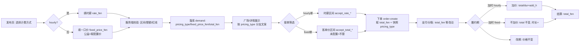

# 定价与爽约：业务逻辑与业务流程设计（2026-10-07 · 实施级细化稿）

> 状态：**设计已定稿（口径全部锁定，2026-10-07）；暂不动代码，实施待放行**。本稿是 [design-20261007-pricing-noshow-modify.md](design-20261007-pricing-noshow-modify.md)（决策口径稿）的**业务逻辑与流程细化**：
> - 口径基线（已拍板）：一口价与时薪价并存 / 一口价加时不加价 / 客单价区间筛选 / 公益归入一口价 / 禁改期范围 S3+S3.5；留空不钳制、未配置不限制等已确认项以原稿为准。
> - **拍板结果（2026-10-07）**：P1-P6、N1-N9 全部按推荐值锁定（见 1.9 / 2.10）；爽约申诉与处罚涉及的**全部数值后台可配**（N10，新增 CONFIG_SCHEMA 键，见 2.11）。
> - **专家审核（2026-10-07）已同步**：6 项整改全部落实——停用拦截范围与"不追溯在途单"口径、广场下推 where 方案锚定、索引设计、0 元加时不重算分账、CONFIG_SCHEMA 范围写死、config_public 手写映射补录。
> - 本稿新增：端到端流程、逐点处理策略（含 rate_fen 全仓排查表）、双端界面与通知矩阵、**3 个关键现状断链的发现与修复方案**。
> - 行号说明：均为 2026-10-07 只读调研结果，实施前逐处复核。

---

## 0. 总览：3 个必须先知道的现状断链

调研中发现的既有缺口（不修复则新功能无法成立）：

| # | 断链 | 现状事实 | 影响 |
|---|---|---|---|
| ① | **公益单云侧断链** | 前端有完整公益 UI（发布开关、公益标识、广场公益筛选、无预算校验），但云端写库**恒为 `project_attr:'commercial'`**（demand-publish:541 硬编码），公益语义只存在于前端 | 「公益单归入一口价」无法成立：线上公益单本质是"时薪 30 元"的商业单；广场公益筛选/标识对线上单全部失效 |
| ② | **「停用 7 天」处罚断链** | `penalty(suspend_7d)` 写 `status:'suspended'` + `suspend_until`（admin-action:2858-2861），但**全仓没有任何入口拦截 `suspended`**（各入口只拦 frozen/banned），也**没有到期自动解除逻辑** | 爽约累计 3 次→停用 7 天：实际不停用、也不会解除；处罚链路不可用 |
| ③ | **rate_fen 读取点比预想多** | 除既定 4 处外，还有：广场价格下推（home-action:425-428，**一口价单会被时薪区间误过滤**）、个人页反推时薪（profile.js:232）、广场"单价"排序（square.js:214）、匹配兜底价（demand-match:116/158/443）等 | 一口价单 `rate_fen` 为空，漏改会导致：耍伴看不到单 / 价格显示错乱 / 排序异常 |

三批实施节奏不变（禁改期 → 定价 → 爽约）；本稿为定价与爽约两批的**实施依据（业务侧）**。

---

## 第一部分：定价 —— 一口价与时薪价并存

### 1.1 概念与口径

| 术语 | 定义 |
|---|---|
| 时薪价 hourly | 传统模式：`rate_fen`（分/小时）× `duration_h`（小时）= `total_fen` |
| 一口价 fixed | 新模式：直接定总价 `fixed_price_fen` = `total_fen`（一次服务总价，不随分钟变化） |
| 公益单 | **一口价的特例**：`pricing_type='fixed'` + `project_attr='public_welfare'`，价格取后台 `welfare_fixed_price_fen` |
| 统一结算口径 | 两种模式一律收敛到 `total_fen`：下单/分账/支付/青年限额/结算**全部沿用，链路零改动** |
| 缺省兼容 | demand 无 `pricing_type` 字段 → 一律按 `hourly` 处理（存量单零迁移） |

### 1.2 数据模型与字段规则

```
demand:
  pricing_type      'hourly' | 'fixed'     新增；缺省（无字段）= hourly
  project_attr      'commercial' | 'public_welfare'   存量字段；云侧现状恒 commercial（断链①）
  rate_fen          hourly 必填（≥100 且在 rate_min/max 区间内）；fixed 单写 null（不写 0）
  fixed_price_fen   fixed 必填（>0；若 fixed_price_min/max 已配置则在区间内）
  total_fen         统一结算口径：hourly = rate×duration；fixed = fixed_price_fen
  duration_h        两种模式均必填（服务时长，影响红线/加时/展示）
order_main（下单快照，order-create:586-603）:
  pricing_type      新增快照（必须）
  rate_fen          仅 hourly 写入；fixed 写 null
  total_fen         照抄 demand.total_fen（唯一结算口径）
```

### 1.3 业务规则总表

| 环节 | 规则 |
|---|---|
| 发布·hourly | `rate_fen` 整数分 ≥100 且落在 `rate_min_fen~rate_max_fen`（兜底 3000/10000，现状保留，demand-publish:362-371）；`total_fen = rate_fen×duration_h` |
| 发布·fixed | `fixed_price_fen` 整数分 >0；**若** `fixed_price_min_fen`/`fixed_price_max_fen` 有配置（非空）→ 须在区间内；**留空 = 不钳制**（口径已确认，但仍保留 >0 与青年限额校验） |
| 发布·公益 | `pricing_type='fixed'` + `project_attr='public_welfare'` + `fixed_price_fen = welfare_fixed_price_fen`；**该配置未设置时公益单不可发布**（入口禁用 + 提示"公益单暂未开放"）；旧键 `welfare_hourly_rate_fen` 保留读兼容（存量/兜底） |
| 发布·通用 | 青年限额：18-22 岁任一方时 `total_fen ≤ youth_limit_fen`（兜底 20000 分，demand-publish:432-436）→ 两模式通用；时间红线、时间窗冲突、免责声明等校验完全沿用 |
| 展示 | hourly 显示「¥X/小时」；fixed 显示「一口价 ¥X」；公益显示「公益免费」（沿用现值链路） |
| 接单筛选 | hourly 单 → 比对耍伴时薪区间 `accept_rate_min_fen/max_fen`（现状）；fixed 单 → 比对**新增客单价区间** `accept_total_min_fen/max_fen`；**未配置 = 不限制**（宁松勿错）；公益单：**豁免价格区间筛选**（已确认 P3=A） |
| 下单 | order-create 仍取 `demand.total_fen`；接单价格校验按 `pricing_type` 分支（fixed 不走时薪区间，避免"rate=0 低于最低价"误拦，见 1.5-#2） |
| 支付/分账 | 零改动（money_rules 入参 total_fen） |
| 加时 extend | **fixed：`add_amount_fen = 0`、`total_fen` 不变、仅 `duration_h + add_hours`**；UI 明确提示"一口价订单延长时长不加价"；hourly：现状逻辑不变（`total/dur×add_hours`，order-action:1044） |
| 改期 | 价格不变（两种模式一致，与第一批禁改期改动无冲突） |
| 结算 | 零改动 |

### 1.4 端到端业务流程



后台配置流程（三端同源）：admin 在后台改 3 个新键 → `config_set` → `CONFIG_SCHEMA` 泛化 → admin-web UI 自动渲染 + 前端 bootstrap + 云函数 `getConfig` 读取（机制同 rate_min_fen，无需逐端硬编码）。

### 1.5 rate_fen 全仓读取点排查与逐点处理策略

> 类别：**必改** = 不改会导致错误；**需分支** = 按 pricing_type 处理；**无需改** = 天然兼容。

| # | 位置（文件:行号） | 现状 | 处理 |
|---|---|---|---|
| 1 | demand-publish:285 / 362-371 / 426 | 发布校验+算价（hourly） | **需分支**：fixed 走新字段与新区间；hourly 原逻辑 |
| 2 | order-create:513-522 | 接单时薪区间校验（`Number(demand.rate_fen)||0` → fixed 单=0 必低于最低价→**误拦**） | **必改**：按 pricing_type 分支；fixed 走 accept_total_*，未配置不限 |
| 3 | order-create:602-603 | 订单快照 rate_fen/total_fen | **需分支**：加 pricing_type；fixed 的 rate_fen 写 null |
| 4 | home-action:425-428（square 下推）；153/591/642（首页/其他） | 按 rate 区间**下推 DB 查询**（`rate_fen >= lo AND <= hi`；fixed 单 rate_fen=null → **被误过滤，耍伴看不到一口价单**） | **必改（方案已锚定）**：rateCond 改为 `_.or([{rate_fen: gte(lo).and(lte(hi))}, {pricing_type: 'fixed'}])`——一口价单豁免时薪区间，与 `_.or([hallWhere(rateCond), ownWhere])` 既有嵌套兼容（存量单无 pricing_type 字段 → 走 rate 分支不受影响），保证 limit 取满 |
| 5 | home-action:267-269（loadVisitorPartner） | 访客/耍伴视角过滤装载 | 同上（消费侧跟着 #4 走） |
| 6 | home-action:212（budget=rate/100） | 广场列表返回展示价 | **需分支**：fixed 单返回定价格式数据（前端配合） |
| 7 | demand-publish:859（detail 注入 budget） | 需求详情展示价 | **需分支**：同上 |
| 8 | profile.js:232 | `total/时长` **反推时薪**展示（fixed 单会算出畸高"时薪"） | **需分支**：按 pricing_type 显示（一口价单不反推） |
| 9 | square.js:201-217 / 214 | 广场"单价"排序（前端按 budget 升序；fixed 无 budget → 排序错乱） | **需分支**：一口价单折算时薪（total÷时长）再参与排序（已确认 P1=B） |
| 10 | order-action:1044（extend 算价） | 加时按时薪折算 | **需分支**：fixed → 0 元加时（保留时长累加）；注意 1045-1047 的"金额异常"拦截需放行 fixed 分支 |
| 11 | order-action:1095-1160（extend_confirm） | 确认后并入金额+重分账（`splitOrderAmount(newTotal)` 重写 fee/income，:1134-1147） | **需分支**：fixed 时**跳过重算**——仅 `duration_h += add_h`，不调用 splitOrderAmount、不重写 total/fee/partner_income（避免以当前费率重算历史总额）；不新增 settlement/pay_transaction（现状确认时本就不产生，结算在 S5 生成）；通知文案改"时长延长至 X 小时（一口价，不加价）" |
| 12 | pay.js:74-75 / pay.wxml:32 | 支付页"单价×时长"拆分 | **需分支**：fixed 显示"一口价" |
| 13 | 前端「/小时」文案点（publish.wxml:141、demand-card:26、partner-card:41-42、demand-detail:30/66、order-detail:269、pay.wxml:32、profile.wxml:120、accept-config:63/73/108/112/117、admin/config.wxml:44） | 10+ 处硬编码「/小时」 | **需分支**：逐点按 pricing_type 出文案（实施时用排查表核对，勿漏） |
| 14 | demand-match:116/158/443（scene_rates 兜底） | 匹配用场景默认时薪兜底 | **需核实**：fixed 场景下兜底策略（低风险，实施时确认） |
| 15 | partner-action:525（scene_default_rate_fen 展示） | 耍伴配置展示参考价 | 无需改（仍是时薪参考） |
| 16 | admin-action:1130/1149/1178（后台订单展示） | 后台列订单金额 | 无需改（total_fen 通用）；**建议**后台补 pricing_type 展示（可选） |
| 17 | orders.js:29-32 / my-demands.js:17-20 / util.js:3-10 | 金额格式化（元/分） | 无需改（数值通用，展示文案随 #6/#7 数据） |
| 18 | init-db:82 / mock 数据 | 种子 | 无需改（种子可加一口价样例，可选） |

### 1.6 后台配置项（CONFIG_SCHEMA 三端同源）

| 键 | 类型 | 默认 | 语义 |
|---|---|---|---|
| `fixed_price_min_fen` | int | **无默认（留空）** | 一口价区间下限；留空 = 不做下钳制 |
| `fixed_price_max_fen` | int | **无默认（留空）** | 一口价区间上限；留空 = 不做上钳制 |
| `welfare_fixed_price_fen` | int | **无默认（留空）** | 公益一口价；未设置时公益单不可发布 |

实现约定（沿用 CONFIG_SCHEMA 机制，admin-action:94+，`{f,t,g,label,unit,min,max,def}`）：
- "留空"语义的实现必须显式判空（`null/undefined/''`），**禁止 `||` 兜底吞值**（项目"0 是合法值"红线教训）；
- 校验用 `Number.isFinite` 判定"是否配置"；`welfare_hourly_rate_fen` 旧键保留（读兼容）。

### 1.7 界面与文案（改动点清单）

| 端 | 位置 | 改动 |
|---|---|---|
| 发布页 | publish.wxml/js | 新增「计费方式」切换器（时薪/一口价）；切换联动输入框与文案；公益单沿用现有开关（选公益=一口价特例）；**建议价提示**：有配置区间时展示区间、无配置降级为文字提示（已确认 P2） |
| 广场/详情/卡片 | demand-card、demand-detail、square | 按 pricing_type 显示「¥X/小时」/「一口价 ¥X」；公益标识逻辑沿用 project_attr（依赖断链①修复） |
| 接单配置页 | accept-config | 新增「客单价区间（一口价单）」输入（留空=不限）；公益开关存量半成品本期**不做**（已确认 P4=B，公益单对全体耍伴可见可接） |
| 订单详情 | order-detail | 加时入口提示"一口价订单延长时长不加价"；价格展示分支 |
| 支付页 | pay | 一口价单显示总价，不拆分单价×时长 |
| 后台 | admin-web Config/Operations.vue | 自动渲染 3 个新键（机制同源，无需单独开发）；建议订单列表补 pricing_type 标签（可选） |

### 1.8 边界与异常

1. **存量数据**：无 `pricing_type` → hourly；存量公益单（实为 commercial）不迁移，仅新单生效（与"不批量迁移"口径一致）。
2. **一口价单 rate_fen 为空**：所有展示/筛选/排序以 `pricing_type` 分支为唯一判据，**不允许任何 `rate_fen` 的 `||0` 兜底后直接参与判断**（排查表 #2/#4 就是活例）。
3. **公益归入一口价后**：`total_fen = welfare_fixed_price_fen`；青年限额照常校验。
4. **加时 0 元单**：fixed 加时 `add_amount_fen=0` 需绕过"金额异常"拦截（order-action:1045-1047）；`extend_confirm` 的 fixed 分支**不重算分账、不写结算/流水**（详见排查表 #11），避免 0 元流水污染账本或以新费率重算历史总额。
5. **区间留空**：发布校验跳过区间检查，但 `>0` 与青年限额不可跳过（红线）。

### 1.9 定价·待确认项（已全部确认 · 2026-10-07）

| 编号 | 事项 | 已确认口径 |
|---|---|---|
| **P1** | 广场「单价」排序对一口价单的口径 | **B**：一口价单折算时薪（total÷时长）再参与排序 |
| **P2** | 发布页「建议价」提示的数据源 | **A**：展示后台配置区间；无配置时降级为文字提示 |
| **P3** | 公益单是否豁免客单价区间筛选 | **A**：豁免（接不接由公益开关管，本期开关不做） |
| **P4** | 耍伴「公益接单开关」存量半成品 | **B**：本期不做，公益单对全体耍伴可见可接 |
| **P5** | fixed 单 `rate_fen` 存储值 | **A**：写 null（显式无值） |
| **P6** | 断链①（公益单云侧落 `project_attr`）纳入本期 | **A**：纳入 |

---

## 第二部分：爽约处罚 —— 用户举证 + 管理端裁定

### 2.1 判定模型与原则

- 平台**无法自动判定"人到没到"** → 一切处罚**必须**经「申诉提交 → 被诉方举证 → 管理员裁定」链路，**不设自动处罚**。
- 处罚全部复用现有能力（扣分/停用），**零新增基础设施**；MVP 为 mock 支付，**不做资金赔付**。
- 订单状态机不因申诉改变（订单照常流转；申诉记录独立）。

### 2.2 角色、资格与时限（已确认 2026-10-07；数值全部后台可配，键见 2.11）

| 项 | 规则 |
|---|---|
| 可申诉状态 | 约定开始时间已过，且订单为 **S2（已支付未开始履约）** 或 **S3.5（履约中断）**；S3 中途、S4/S5 走既有投诉（S10.5）（N1=A） |
| 申诉时限 | 约定开始时间后 **N 小时**内可提交（默认 48，`no_show_report_window_h`） |
| 申诉人 | 订单参与方任一方（user/partner），同一订单单方**最多 1 条**申诉（双方共 2 条上限，`no_show_max_per_order`）（N6=A） |
| 被诉方答辩 | 收到通知后 **N 小时**内可提交举证（默认 48，`no_show_defense_window_h`）；逾期不自动关闭，管理员可径行裁定（N2=A） |
| 裁定人 | 平台管理员（admin-action 权限组 R2/R3，与 dispute_handle 同：admin-action:32） |

### 2.3 状态机与业务流程

```mermaid
flowchart TD
  A[一方提交申诉<br/>原因+文字+照片] --> B[受理 received<br/>通知被诉方举证]
  B --> C{被诉方举证?}
  C -- 窗口内提交 --> D[举证中 defense<br/>记录答辩+证据]
  C -- 超时未提交 --> E[仍待裁定<br/>标记 overdue]
  D --> F[管理员裁定]
  E --> F
  F -- 成立 upheld --> G[执行处罚<br/>扣分+计数(+停用)] --> H[通知双方]
  F -- 不成立 rejected --> I[关闭] --> H
```

- 申诉与答辩**均需通过内容安全检测**（msgSecCheck，失败降级违禁词——与 IM 同口径；拒绝入库）。
- 同一订单同一被诉方**不得重复处罚**（幂等键：order_id + target_openid）。
- 撤回：一期不做（裁定前不可撤回，N8=A）。

### 2.4 处罚规则与能力复用映射

| 处罚 | 复用能力（位置） | 执行细节 |
|---|---|---|
| 信用分 **−N 分**（默认 20，可配；`type:'no_show'`） | credit_score_log 写入模式（user-login:149-152 logCredit / admin-action:795-822 user_credit_adjust 的 clamp 模式） | 按被诉方角色扣 `partner_credit_score` 或 `user_credit_score`；`score_type` 字段标注角色；写 reason（含 order_no）与 admin_openid |
| 累计 **N 次 → 停用 M 天**（默认 3 次 / 7 天，可配） | `penalty(level='suspend_7d')`（admin-action:2841-2878）等价逻辑 | 写 `status='suspended'`、`suspend_until=now+M 天`、`suspend_reason`、关 `accept_switch`、logEvent P1 |
| 计数 | credit_score_log（`type:'no_show'`）按**滚动窗口**（默认 180 天）聚合（N3=B，分角色）；user_account 冗余字段仅作展示快照 | 裁定时聚合判定"第 N 次"，窗口内达阈值触发停用 |
| 天然联动 | 信用分 <600 禁下单/接单（多个入口已实现，如 order-create:335/547、demand-publish:384） | 零改动 |
| 资金赔付 | — | **本期不做**（mock 支付） |

> **断链②修复（必须配套，否则"停用 7 天"不生效）**：
> 1. **拦截范围（已定稿）**：suspended 仅拦截**新行为入口**——发单（demand-publish）、接单（order-create）、接单申请（partner-apply）、发布更新等；对 `status==='suspended'` 且 `suspend_until>now` 的账号返回"账号停用中，N 天后自动恢复"（N 动态取配置）。**登录与在途订单操作不拦截**（保证在途履约、申诉/举证可进行）。
> 2. **不追溯在途订单（已定稿）**：停用不中断已有订单——S3/S3.5 等流转照常；停用只阻止新发单/新接单/新申请。
> 3. **补解除**：**登录时惰性恢复**（user-login 读取 user 文档处：若 `suspended` 且已过期 → 写回 `status='normal'` + 通知）；已到期未恢复的按 normal 放行（N5=A，零新增定时任务）。
> 4. **改造清单（实施时逐处扩展）**：`frozen/banned` 拦截点（user-login:285-289/908-909/1103-1104、order-create:313-315/535-541、demand-publish:346-350/1032-1033、partner-apply:125-129）；**另两处按 status 过滤的查询**——`home-action:454`（活跃用户栏，黑名单式 `nin(['frozen','banned','closed'])`）建议补入 `suspended` 排除；`home-action:328`（推荐栏，白名单式 `in(['normal','banned','frozen'])`）suspended 天然不在白名单（已排除），实施时与该栏展示语义一并确认。

### 2.5 数据模型

```
no_show_report（新集合）
  order_id, order_no
  reporter_openid, reporter_role      'user' | 'partner'
  target_openid, target_role
  reason                              申诉理由（过内容安全）
  evidence_file_ids[]                 申诉证据照片 fileID（≤N 张，默认 3，可配；可选）
  defense_reason                      被诉方答辩（过内容安全）
  defense_file_ids[]                  答辩证据（≤N 张，默认 3，可配；可选）
  status   'received' | 'defense' | 'decided'    （原稿 S0/S1/S2 的等价命名，推荐用词串避免与订单 13 态字面量混淆）
  evidence_deadline                   created_at + 举证窗口（可配，默认 48h）
  verdict  'upheld' | 'rejected'      裁定结果
  decided_by, decided_at, decided_reason
  penalty_applied                      {score_delta, suspend_until | null, applied_at}   裁定成立时写入
  created_at, updated_at, is_deleted
user_account（扩展）
  no_show_count 展示快照（判定以 credit_score_log 按滚动窗口聚合为准，分角色）
```

**索引（新增，经 init-db 增量补建；实施时先核实现有索引现状）**：

| 集合 | 索引 | 用途 |
|---|---|---|
| `no_show_report` | `order_id` | 幂等查重（同订单申诉判定） |
| `no_show_report` | `status + created_at` | 管理端列表（待处理筛选 + 倒序） |
| `no_show_report` | `target_openid + created_at` | 被诉方历史查询 |
| `credit_score_log` | `openid + type + created_at` | 裁定聚合"滚动窗口内第 N 次爽约"（无索引将全表扫） |

### 2.6 双端界面设计

**用户侧（miniprogram）**
| 界面 | 内容 |
|---|---|
| 入口 | 订单详情页（S2/S3.5 且符合时限）显示「报告爽约」按钮（双端均可见；已有按钮区参照 order-detail.wxml:124-185 的 my_role 条件渲染模式） |
| 提交页（新建） | 原因选择（未出现/迟到超30分钟/中途离开/其他）+ 文字说明（必填，最短字数可配，默认 10）+ 照片上传（张数可配，默认 ≤3 张；复用 chooseMedia+uploadFile 模式，参照 partner-profile-edit.js:222-249） |
| 进度/结果 | 订单详情页横幅（"爽约申诉处理中 / 已裁定"）+ system_notice 跳转；被诉方视角显示"对方提交了爽约申诉"→ 举证页（答辩文字+照片） |
| 页面归属 | 建议放 `pages-v2/pkg-low/`（分包，控制主包体积）——实现细节 |

**管理端（admin-web）**
| 界面 | 内容 |
|---|---|
| 列表页（新建） | 状态筛选（待处理/举证中/已裁定）+ 订单号/双方/时间；参照 Dispute.vue / Report.vue 范式 |
| 详情与裁定 | 申诉与答辩内容、证据图片（复算临时 URL，参照 admin-action:61-72 resolveTempUrls）、裁定按钮（成立/不成立）+ 裁定说明（必填）；成立时展示"将执行：扣 N 分（默认 20）+ 第 M 次（满阈值停用）"预览（数值动态取配置） |
| 接入 | 路由 router/index.js + 菜单 Layout.vue:13-16 + api/admin.js 代理（新增 2 个 action） |

### 2.7 通知矩阵（system_notice，复用现有字段规范）

| 时点 | 收件人 | 类型/文案 |
|---|---|---|
| 提交申诉 | 被诉方 | `no_show_report`："对方提交了爽约申诉，请在 N 小时内举证"（N 动态取配置；action_key=jump_order） |
| 被诉方举证 | 申诉方 | "对方已提交举证，等待平台裁定" |
| 裁定成立 | 双方 | "爽约申诉已裁定：成立。已按规则处理"（不向申诉方暴露具体分值细节，被诉方收到明细） |
| 裁定不成立 | 双方 | "爽约申诉已裁定：不成立" |
| 停用执行 | 被诉方 | "信用分累计 N 次爽约，账号停用 M 天，将于 X 日自动恢复"（数值动态取配置） |
| 到期恢复 | 被诉方 | "账号停用期已结束，已恢复"（N5=A：登录时惰性恢复触达） |

> 管理员提醒：可选复用 errorScan 的 admin_openids 推送（order-timer:85-98 为全仓唯一先例）新增"待裁定积压"提醒——建议一期不做（管理端列表可见即可）。

### 2.8 与现有体系的边界

| 体系 | 关系 |
|---|---|
| S10.5 争议（complaint/dispute_handle，order-action:1296-1357、admin-action:1246-1306） | **互不替代**：S10.5 处理订单金额/服务争议（改单状态）；爽约处罚独立于订单状态，不改金额、不改状态 |
| 评价体系 | 不联动（评价默认 4 星等逻辑 order-timer:353-423 不受影响） |
| 资金 | 本期零资金动作（mock）；真实支付接入后再评估赔付 |
| IM | 不新增模板（通知走 system_notice） |

### 2.9 实施影响面（为后续实施储备）

1. **新集合纳管（两处必做）**：`no_show_report` 加入 ①admin-action `EXPORT_COLLECTIONS`；②`.predeploy/manual-backup.ps1` 的 `$COLLECTIONS`（config_history 踩坑教训：否则不可观测、不可备份）；并按 2.5 索引表经 init-db 增量补建索引（credit_score_log 聚合索引为核心）。
2. **云函数 action（不新增云函数）**：用户侧挂 `order-action`（`no_show_report_submit` / `no_show_report_defense` / `no_show_report_detail`）；管理端挂 `admin-action`（`no_show_report_list` / `no_show_decide`）+ **config_public 手动补 `no_show` 数值组**（手写映射，见 2.11 约定 2）。
3. **前端**：新页面（提交/举证）+ 订单详情入口与横幅 + app.json 注册。
4. **断链②修复**：各入口 suspended 拦截（改造清单见 2.4）+ user-login 惰性恢复。
5. **门禁**：新 action 需入单测（108 条基线扩充）；部署走串行链路（order-action → admin-action；admin-web 需重建）。

### 2.10 爽约·待确认项（已全部确认 · 2026-10-07）

| 编号 | 事项 | 已确认口径 |
|---|---|---|
| **N1** | 可申诉条件 | **A**：仅 S2 + S3.5，时限内可申诉 |
| **N2** | 被诉方不举证 | **A**：不自动关闭，管理员可径行裁定 |
| **N3** | 累计停用口径 | **B**：滚动 180 天（可配）、分角色计数 |
| **N4** | 恶意申诉 | **A**：一期仅记录，不处罚 |
| **N5** | 断链②（suspended 拦截+到期恢复） | **A**：纳入本期 |
| **N6** | 同订单申诉上限 | **A**：双方各 1 条（可配） |
| **N7** | 处罚对称性 | **A**：user/partner 对称 |
| **N8** | 复核/撤回通道 | **A**：一期不做 |
| **N9** | 管理端提醒 | **A**：一期不做（列表可见即可） |
| **N10** | **爽约数值后台化**（2026-10-07 PRD 拍板） | 申诉与处罚涉及的全部数值经 CONFIG_SCHEMA 后台可配（见 2.11） |

### 2.11 爽约数值后台化（已确认；CONFIG_SCHEMA 新增键）

> 项目铁律"所有参数后台可配置"（前端仅为兜底默认值）。以下键经 admin-action CONFIG_SCHEMA 新增，三端同源（config_set → resolveOperations → admin-web UI / config_public → 前端 bootstrap / 云函数 getConfig）。

| 键 | 类型 | 默认 | 范围（min-max） | 语义 |
|---|---|---|---|---|
| `no_show_report_window_h` | int | 48 | 1-168 | 申诉时限：约定开始时间后 N 小时内可提交 |
| `no_show_defense_window_h` | int | 48 | 1-168 | 举证窗口：被诉方 N 小时内可举证 |
| `no_show_score_deduct` | int | 20 | 0-100 | 裁定成立扣分（0 = 仅计次不扣分） |
| `no_show_suspend_threshold` | int | 3 | 1-10 | 滚动窗口内累计 N 次 → 停用 |
| `no_show_suspend_days` | int | 7 | 1-90 | 停用天数 |
| `no_show_count_window_days` | int | 180 | 7-365 | 次数统计滚动窗口（天） |
| `no_show_evidence_max` | int | 3 | 1-9 | 双方举证照片上限 |
| `no_show_reason_min_len` | int | 10 | 5-200 | 申诉理由最短字数 |
| `no_show_max_per_order` | int | 1 | 1-3 | 同订单单方申诉次数上限 |

约定：
1. 全部**有默认值**（业务判定必须有值；与定价区间"留空 = 不钳制"语义不同），范围如上表，经 CONFIG_SCHEMA `min/max` 写死（实施时直接抄）；
2. **服务端判定一律读 `getConfig` 实配值**；前端经 `config_public` 透出——注意 config_public（admin-action:396-491）是**手写映射**（如 rate_range:408），需**手动补 `no_show` 组**（resolveOperations 泛化只覆盖 config_get，不会自动出现在 config_public）；前端 `NO_SHOW{scoreDeduct,maxTimes,suspendDays}`（config/index.js:62-63）降级为兜底默认值；
3. 所有通知与界面文案中的数字（"请在 N 小时内举证""累计 N 次停用 M 天"）一律动态取配置值，禁止硬编码。

---

## 第三部分：实施衔接

1. **节奏不变**：第一批（禁改期）→ 第二批（定价）→ 第三批（爽约），每批独立验收、不得跳批。
2. 本稿**已定稿**（2026-10-07 口径全锁定）：定价侧"逐点处理策略表"+ 断链①；爽约侧全流程 + 断链② + **数值后台化（2.11）**；实施时以「原稿（口径）+ 本稿（流程）」双文档为依据。
3. **实施状态：暂不动代码，待 PRD 放行**。放行后按三批链路执行（每批：改 → node --check → npm test → 串行部署 → gate 七步 → 云端/真机验证 → deploy-log → commit/push）。