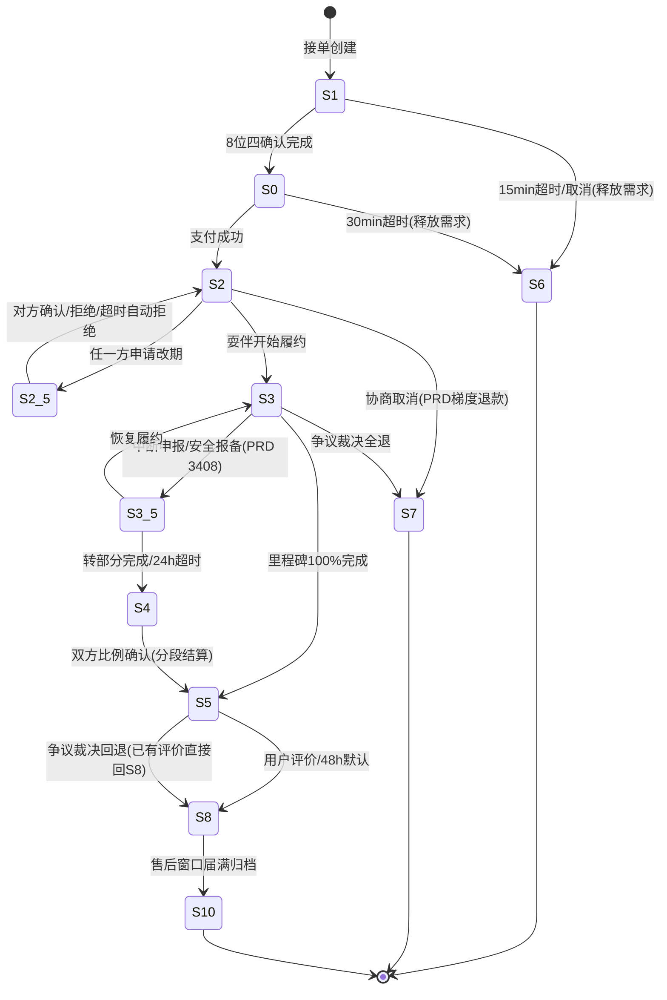
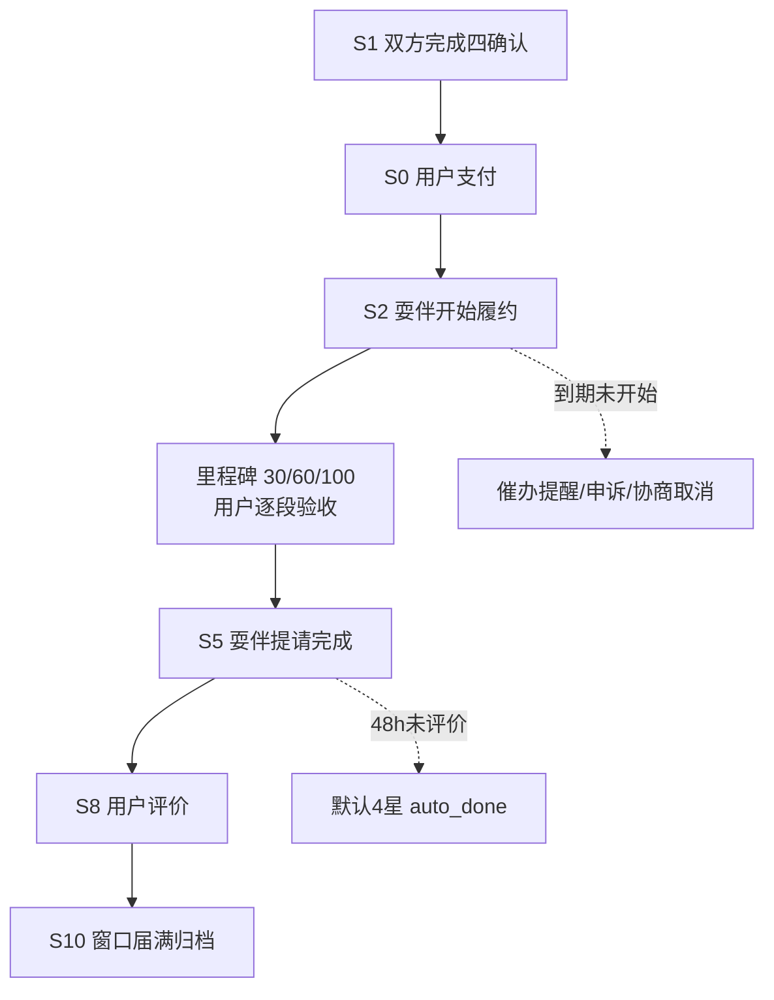
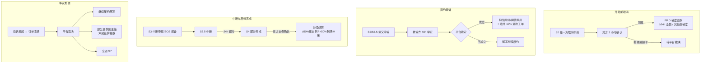

# 履约域（付款后）业务逻辑与流程设计方案

> 版本 v1.1（业务实际逐项复核后修订）· 2026-10-10 · 基线 commit `276b946` · 状态：**设计方案（供评审，未实施）**
> 范围：需求发布/接单撮合之后、订单进入履约期的全部业务情形（四确认 → 支付 → 履约 → 完成 → 评价 → 结算 → 售后）
> 依据：全部结论来自代码实证，行号以基线 `276b946` 为准

---

## 0. 一页结论

**现状三个结构性病灶**（详见 §2，共 15 条诊断）：

1. **状态机是"补丁演化"产物**：13 个状态中 `S3.5 履约中断` 和 `S10 已关闭` 是**孤儿状态**（全仓无任何代码写入这两个状态，但各自挂着 3~4 个消费者死守）；S8/S9 双轨评价、S2_5/S3.5/S10.5 编码风格不一，本质是把「履约进度、评价方式、争议、资金」四个维度压进了一个 `status` 字段。
2. **资金动作缺乏一致的规则面**：退款能力与 PRD 梯度退款设计背离（前端无入口、云函数层却放行 S2/S3 全额自助退）；部分退款即终态（退 ¥10，80 元单直接关闭）；`ratio_fen` 比例确认落库但**结算完全不消费**（部分完成按 100% 结算，违背 PRD「部分完成按比例结算」）；加时费"确认即负债"无二次支付。
3. **"等待"没有守夜人**：S2 待履约、S4 部分完成两个状态**无任何超时兜底**（前端却宣称 S4 有"裁定期"）；爽约申诉与订单状态完全解耦且不联动资金救济。

**目标设计五个原则**（详见 §3）：

1. 主状态只表达**履约进度轴**，争议/评价/资金/冻结用正交字段；
2. 每个"等待中的动作"必有**超时兜底**（timer 全覆盖）；
3. 每笔资金动作必有三件套：**流水 + 订单字段 + 双方通知**；
4. 用户自助操作**不得直接触发资金流出**（退款必经对方确认或平台裁决）；
5. 状态迁移唯一入口 `casTransition`（from × event → to 表驱动，全量单测）。

**分期路线一句话**：提审前零行为改动；提审后 P1 批止血（补超时兜底/孤儿状态/冻结位），P2 批资金安全（退款收敛/比例结算/加时补付），P3 批结构重构（正交位 + 迁移表驱动）。

---

## 1. 现状盘点（代码实证）

### 1.1 状态清单（13 态）

| 码 | 前端名 | 进入方（谁写入） | 离开方 | 超时兜底 | 结算资格 |
|---|---|---|---|---|---|
| S1 | 待确认 | 接单创建 | 8 位四确认→S0；取消→S6 | 15min→S6（释放 demand） | 否 |
| S0 | 待支付 | 四确认完成 | 支付→S2；取消→S6 | 30min→S6（**不释放 demand**） | 否 |
| S2 | 已支付待履约 | mock_pay | start_service→S3；自助退→S7；改期→S2_5 | **无** | 否 |
| S2_5 | 改期处理中 | modify（仅 S2） | confirm/reject→S2；超时→S2/S3 | confirmHours→自动拒绝 | 否 |
| S3 | 履约中 | start_service | complete→S5；自助退→S7；加时(原地) | 里程碑 15min 自动确认 | 否 |
| S3.5 | 履约中断 | **无（孤儿；PRD 设计=safety-report 安全报备触发，实现漏写）** | resume→S3；partial→S4 | 24h→S4 | 否 |
| S4 | 部分完成 | partial_confirm；timer | ratio_confirm→S5 | **无（前端宣称有裁定期）** | 否 |
| S5 | 已完成 | complete_service；ratio_confirm | 评价→S8；投诉→S10.5 | 48h→S9 默认 4 星 | 否 |
| S6 | 已取消 | cancel；timer S1/S0 超时 | 终态 | — | 否 |
| S7 | 已退款 | mock_refund；dispute_handle | 终态（**不分全额/部分**） | — | 否 |
| S8 | 已评价 | evaluation-submit | 投诉→S10.5；售后窗口届满→？ | **无（S10 无人生产）** | **是** |
| S9 | 评价超时 | timer 默认评价 | 无离开方 | — | **是** |
| S10 | 已关闭 | **无（孤儿）** | dispute open 分支要求 S10 起步（死路） | — | **是** |
| S10.5 | 争议处理中 | complaint（S5/S8/S9） | 撤回→回 from_status；裁决→S7/S5 | 无一审/二审超时 | 否 |

关键证据：
- 前端 13 态 SSOT：`miniprogram/config/enums.js:88-103`
- 四确认 8 位（time/location/content/fee × 双方，任一修改全重置，全确认 S1→S0）：`order-action/index.js:14-15,26`
- `S3.5` 全仓仅 2 处出现于读侧（`order-timer:395`、`order-action:1213`），无任何写方（safety-report 只写 help_flag 不写 status，`safety-report/index.js:255`；`interrupted_at` 亦无写方）→ resume/partial_confirm/24h 兜底/爽约申诉资格（S2/S3.5）**四条消费链全部不可达**；PRD_v15.1.md:3408-3423 原本设计「安全报备触发紧急求助或报告安全事件即进入 S3.5、24h→S4、双向确认」——**实现时 safety 链漏写 status**
- `S10` 全仓无写方；admin `dispute_handle` 的 `open` 分支（S10→S10.5，`admin-action:1478-1480`）永不可用
- 结算口径「S8/S9/S10 算已结算」仅靠注释约定：`_shared/money_rules.js:85`

### 1.2 用户动作清单（order-action 28 action 中履约相关）

| 动作 | 角色 | 前置状态 | 迁移 | 副作用 |
|---|---|---|---|---|
| confirm_item / update_item / confirm_all | 双方 | S1 | 8 位全满→S0 | 修改任一项重置 8 位 |
| cancel | S1 双方 / S0 仅用户 | S1/S0 | →S6 | S1 取消释放 demand；S0 不释放 |
| start_service | 耍伴 | S2 | →S3 | 初始化里程碑 {0,[F,F,F]} |
| milestone_submit / confirm | 耍伴提/用户确认 | S3 | 原地 | 30%→60%→100% 三段 |
| complete_service | 耍伴 | S3 + 里程碑=100% | →S5 | 通知用户评价 |
| modify / modify_confirm / modify_reject | 双方 | 仅 S2 可发起 | S2→S2_5→S2/S3 | 确认后重置四确认位；改 start_time |
| extend / extend_confirm / extend_reject | 双方 | 仅 S3 | 原地 | 加时金额直接并入 total_fen 并重算分账 |
| resume_service | 双方任一方 | S3.5 | →S3 | （不可达） |
| partial_confirm | 双方任一方 | S3.5 | →S4 | （不可达） |
| ratio_confirm | 双方任一方（单方即可） | S4 | →S5 | 写 ratio_fen(0-100%，缺省 100%) |
| complaint | 双方 | S5/S8/S9 | →S10.5 | 写 complaint 集合；记 from_status |
| complaint_withdraw | 仅发起人 | S10.5 未受理 | →from_status | complaint 集合标 withdrawn |
| no_show_report_submit / defense / withdraw | 双方 | **不改订单状态**（资格：S2/S3.5+时间窗） | — | 独立集合；裁定在 admin |
| mock_pay | 用户 | S0 | →S2 | pay_transaction(type=pay) |
| mock_refund | **仅用户、无对方确认（前端无任何调用入口，仅云函数能力）** | S2/S3 | →S7 全额 | 事务+补偿+双方通知 |
| mock_tip | 用户 | S5+ | 原地 | 可多次，独立流水 |
| 评价 evaluation-submit | 用户 | S5 | →S8 | 信用分、补偿回 S5 |

### 1.3 定时器清单（order-timer 每 5 分钟）

| 分支 | 窗口 | 迁移 | 备注 |
|---|---|---|---|
| S1 超时 | 15min | →S6 | 释放 demand（matched→matching） |
| S0 超时 | 30min | →S6 | **不释放 demand**（需求卡死风险） |
| S3.5 中断 | 24h | →S4 | 消费孤儿状态，不可达 |
| S2_5 改期 | confirmHours | →S2/S3 自动拒绝 | 存量 S3 起始单回 S3 |
| 里程碑 | 15min | 原地全确认 | 用户验收形同虚设 |
| S5 评价 | 48h | →S9 默认 4 星 | 已有评价则 backfill →S8 |
| （缺失） | — | S2 无兜底、S4 无兜底、S8 售后窗口无兜底、S10.5 争议无升级 | 与前端 timeoutText 宣称不符 |

### 1.4 现状流转图（⚠=诊断点）

```
S1 待确认 ──15min──► S6（释放demand）
  │ 8位四确认
  ▼
S0 待支付 ──30min──► S6（⚠D12 不释放demand）
  │ 支付
  ▼
S2 待履约 ◄──► S2_5 改期协商（仅S2可发起）
  │  ⚠D3 无超时兜底；爽约申诉不联动资金
  │ start_service（耍伴）
  ▼
S3 履约中（里程碑30/60/100%，15min自动确认⚠D8）
  │ │ ⚠D1 用户可一键全额自助退 S2/S3──► S7（终态⚠D7）
  │ │ ⚠D4 加时费确认即并入结算，无二次支付
  │ │ ⚠D5 "暂停"无入口 ──► S3.5（孤儿）──resume──► S3
  │ │                                     └─partial/24h──► S4
  │ complete（里程碑100%）
  ▼
S5 待评价 ──48h──► S9 默认4星
  │ 用户评价                 S4 ──ratio_confirm（单方可确认，缺省100%⚠D2）
  ▼                            ⚠D2 无裁定期超时；ratio_fen 不进结算
S8 已评价 ──售后窗口届满──► ？（S10 无人生产 ⚠D5）
  │
  └─ 投诉（S5/S8/S9）──► S10.5 ──撤回──► 回 from_status
                           ├─ 裁决退款 ──► S7（金额可设；部分退也终态 ⚠D7）
                           └─ 裁决完成 ──► S5（⚠D10 若来自S8已有评价，冲突）
  爽约申诉：独立集合不改状态 ⚠D9；裁定只扣信用分，不触发退款救济
  结算：S8/S9/S10 隐式口径 ⚠D15
```

---

## 2. 问题诊断（15 条，按严重度分级）

### P0 —— 资金风险 / 订单卡死

| # | 诊断 | 证据 | 业务后果 |
|---|---|---|---|
| D1 | **用户自助全额退款零约束** | `payment-mock:317-327`：仅校验 `user_openid===openid` 且 S2/S3，无需耍伴同意、无平台审核、无违约金 | 履约进行到 90% 用户也可一键全退，耍伴劳动无保障；与"争议退款需管理员裁决"（dispute_handle）形成双轨，争议链路可被绕过 |
| D2 | **S4 部分完成：无兜底 + 比例不进结算** | timer 无 S4 分支；`ratio_confirm`（`order-action:1284-1336`）单方即可确认、缺省 100%；`ratio_fen` 全仓无结算消费方 | ① 双方不点确认 → 订单永卡 S4、耍伴收入永不结算；② 确认 50% 后耍伴仍按 100% 收入进结算（若后续走到 S8）——资金错算 |
| D3 | **S2 待履约无兜底** | timer 无 S2 分支；爽约申诉不改订单状态、裁定不触发退款 | start_time 过后若耍伴不点开始、用户不申诉，资金永卡 S2；唯一救济是 D1 的自助全额退 |
| D4 | **加时费无资金流** | `extend_confirm`（`order-action:1169-1202`）把 `add_amount_fen` 直接并入 `total_fen` 并重算分账，无第二笔支付 | mock 阶段无感；接入真实支付后"确认加时=平台替用户负债"，对账必然不平 |
| D5 | **孤儿状态 S3.5 / S10** | 全仓无 `status:'S3.5'`、`status:'S10'` 写方；`dispute_handle open` 分支（`admin-action:1478`）要求 S10 起步 | S3.5 的 resume/partial/24h 兜底/爽约申诉资格四条链全部死代码；S10.5 的"已关闭单重开争议"能力永不可用 |

**P0 组性质分级（2026-10-10 业务实际复核）**：
- D1=**「规则缺口 + PRD 背离」**：前端无退款入口（miniprogram 无 mock_refund 调用，S2/S3 无退款按钮），云函数层才是敞口；PRD_v15.1 本有梯度退款（3090）与「待履约用户取消≥24h 全额退款」（6087）设计，**PRD 中就没有"一键全额自助退"** → 修复方向是"补前端入口 + 按 PRD 梯度重建"，不是凭空取消能力。
- D2=**Bug**（实现违背 PRD 3235-3332「部分完成按比例结算」设计）。
- D3/D4=**设计债务**（PRD 无对应规则，属 MVP 刻意未做/简化）。
- D5=**Bug**（PRD 3408 有 S3.5 设计、safety 链路实现漏写 status）。

### P1 —— 业务逻辑不合常理

| # | 诊断 | 证据 | 业务后果 |
|---|---|---|---|
| D6 | **评价双轨冗余 + 双端标签冲突（S3.5 语义相反更严重）** | S8/S9 仅"评价来源"之差；admin `STATUS_LABEL`（`admin-action:339-340`：S8='已结算'/S9='已评价'/S3.5='履约完成'）与前端 enums（S8='已评价'/S9='评价超时'/S3.5='履约中断'）互相矛盾，其中 S3.5 语义完全相反 | 同一状态两端两种名字，运营与用户认知割裂；"已结算"实为结算资格而非已结算动作 |
| D7 | **部分退款即终态** | dispute refund 写 `refund_fen` 后直接 S7（`admin-action:1481-1483`） | 昨日实证：80 元单退 ¥10 → 整单关闭；剩余 70 元既不结算给耍伴也不明确归属 |
| D8 | **验收关虚设** | 里程碑 15min 自动全确认（`order-timer:469-486`） | "用户逐段验收"设计意图落空，complete_service 的 100% 前提自动达成 |
| D9 | **争议域割裂** | complaint 占主状态（S10.5）；no_show 不占状态（`order-action:10-11` 明示不改状态机） | ① 两类争议在 admin 两套页面、两套数据模型；② 爽约申诉期间订单可被单方推进（S2 申诉中仍可 start_service→S3），破坏申诉资格前提 |
| D10 | **裁决"完成"回 S5 与已有评价冲突** | dispute complete：S10.5→S5（`admin-action:1484-1486`）；投诉可来自 S8；evaluation-submit 幂等分支（`evaluation-submit:118-127`）对"已有评价"直接返回 ok 且**不转 S8** | 回 S5 后用户点评价被幂等短路，订单停在 S5；最迟 48h 后由 timer backfill 分支（`order-timer:501-510`）自愈转 S8 —— 期间"已完成订单却待评价"且按钮无效 |
| D11 | **改期重置四确认位语义悬空** | `modify_confirm` 后对独立集合 `order_confirmations` 将 8 位（time/location/content/fee × 双方）全部置 false（`order-action:1033-1040`，注释自证"仅在 S1 消费"），订单已在 S2，S2 后该集合仅剩 detail 展示 | 每次改期多一次全量写、无业务消费者；属残留仪式性动作 |
| D12 | **取消语义不完整** | cancel 仅 S1/S0（`order-action:636`）；S0 超时不释放 demand（`order-timer:366-390` 对比 S1 分支）；前端取消按钮仅 S0 用户侧（`order-detail.wxml:137`），S1 后端放行但前端未放 | ① 已支付（S2/S3）无取消入口，PRD 6087 的"≥24h 全额退款"未落地；② S0 超时后需求仍 matched，重新招募通道被卡死 |

**P1 组性质分级**：D6=**Bug**（前后端文案互斥，含 S3.5 语义相反）；D7=**Bug**（部分退款即终态使剩余价款无归属）；D8/D9=**设计规模风险**（自动确认窗过短致验收落空；两类争议两套管理模型）；D10=**Bug（有 48h 自愈路径，严重度中等）**；D11=**残留死逻辑**；D12=**Bug**（PRD 取消梯度设计未实现）。

### P2 —— 一致性与维护性

| # | 诊断 | 证据 | 业务后果 |
|---|---|---|---|
| D13 | **状态分组无 SSOT** | `ACTIVE/BUSY/FREE_CHAT` 数组散落 6 处硬编码：user-login:29 / im-send:19 / im-conv:40 / partner-action:45 / demand-match:13 / safety-report:21 | 每新增/调整一个状态需同步 6+ 处，漏一处即线上逻辑漂移 |
| D14 | **状态编码风格混乱** | 点号（S3.5/S10.5）与下划线（S2_5）并存，前端再转 `S2_5` | 编号插入式增长（.5 系）暴露无全局状态机设计 |
| D15 | **结算口径隐式** | "S8/S9/S10 算已结算"仅是 `money_rules.js:85` 注释约定，无 `settled_at` 显式字段；结算聚合三处硬编码 status 范围：`payment-mock:643/787`、`admin-action:1646/1654` | 结算边界靠枚举巧合成立；S6/S7 被排除是"恰好"而非设计保证 |

**P2 组性质**：D13/D14/D15 均为**维护性债务**（无即时业务危害，但每次状态调整都是全仓寻址）。

**另据 2026-10-10 复核发现（未编号，纳入目标设计）**：
- 公益/平台补贴单无特殊资金分支：0 元单照走 mock_pay 产生 0 元 pay 流水（`payment-mock:277` 口径 total_fen），退款上限公式自然为 0 → 无害但需在规则面显式定义（见 §3.5 规则 6）。
- `youth_limit_fen`（getConfig 默认 20000）在支付链无消费（mock_pay 无青少年限额校验），消费点待查 → 列入 P2。
- PRD 3628-3678 已定退款到账口径：系统类即时 T+1 / 人工类 3+2 工作日——目标设计的到账提示应沿用。

---

## 3. 目标设计

### 3.1 设计原则

1. **单一职责**：`status` 只表达履约进度轴；争议、评价方式、资金、冻结各自成为正交字段，不再挤占主状态。
2. **等待必有守夜人**：任何"等待对方动作"的状态/子状态都配 deadline 字段，timer 统一扫描，超时走向明确（自动同意 / 自动拒绝 / 升级平台）。
3. **资金三件套**：任何退款/结算 = `pay_transaction` 流水 + `order_main` 字段 + 双方通知，缺一即 bug。
4. **自助不碰钱**：用户侧"取消/退款"只产生**申请**，资金流出必须经对方确认或平台裁决。
5. **表驱动迁移**：全仓唯一 `casTransition(orderId, event, ctx)`，from × event → to 白名单表 + 全量单测；状态分组常量收敛 `_shared/order_state.js` 单源。

### 3.2 状态收编：13 态 → 「一主轴 + 三正交位 + 一冻结位」

**主轴（履约进度，9 态）**：

```
S1 待确认 → S0 待支付 → S2 待履约 → S3 履约中 → S5 待评价 → S8 已完结
                          │(改期协商 S2_5)  │(中断/安全报备 S3.5)  │(部分完成 S4)
终态：S6 已取消(未支付域) / S7 已退款(资金终态) / S10 已关闭(履约正常完结后的归档态)
```

**正交位（`order_main` 新增字段，不占 status）**：

| 维度 | 字段 | 取值 | 替代的旧机制 |
|---|---|---|---|
| 评价方式 | `eval_state` | `pending / user_done / auto_done` | S8/S9 双轨（S9 退役，存量映射 auto_done） |
| 争议 | `dispute_state` | `none / open / resolved(outcome)` + `dispute_type: complaint / no_show / refund` | S10.5 占位（退役）+ no_show 的"隐形争议" |
| 资金 | `fund` | `paid_fen / refunded_fen / settle_state(pending/ready/done) / settled_at` | "S8/S9/S10 隐式算已结算"（D15） |
| 冻结 | `frozen` | `true`（dispute_state=open 期间） | S10.5 靠占主状态实现的"天然冻结"（D9） |

**兼容层**：S 码存量数据不动；提供 `mapStatus(order)` 读兼容（S9→S8+auto_done、S10.5→主轴 from_status+frozen）；新旧代码过渡期双读。

### 3.3 目标状态迁移表（表驱动核心）

| # | 事件 event | 角色 | from | to | 前置校验 | 资金动作 | 超时兜底 |
|---|---|---|---|---|---|---|---|
| 1 | confirm_done | 双方 | S1 | S0 | 8 位确认全满 | — | 15min→S6（释放 demand） |
| 2 | pay | 用户 | S0 | S2 | 支付流水成功 | type=pay 流水 | 30min→S6（**释放 demand**） |
| 3 | cancel | 双方 | S1/S0 | S6 | — | 已付则原路退 | 同上 |
| 4 | cancel_request | 任一方 | S2 | S2(挂起) | — | **按 PRD 取消梯度退款**（≥24h 全额；<24h 梯度扣违约金） | 对方 2h 确认→按梯度退 S7；超时→转平台裁决 |
| 5 | start_service | 耍伴 | S2 | S3 | 未冻结 | — | start_time+Xh 未开始→提醒双方走申诉/取消 |
| 6 | modify_req / ok / no | 双方 | S2 | S2_5→S2 | 未冻结 | — | confirmHours→自动拒绝 |
| 7 | interrupt_report | 任一方申报中断 / safety-report 报备 | S3 | S3.5 | 原因必填，未冻结（对齐 PRD 3408「安全报备触发即中断」） | — | 24h→S4 |
| 8 | resume | 任一方 | S3.5 | S3 | — | — | — |
| 9 | partial_agree | 任一方 | S3.5 | S4 | — | — | 裁限期→按已履约证据转裁决 |
| 10 | milestone_submit/confirm | 耍伴/用户 | S3 | S3 | — | — | 确认窗自动确认（**窗口可配，默认 2h**） |
| 11 | extend_req | 任一方 | S3 | S3 | 未冻结 | — | 对方 2h 未回应→自动拒绝 |
| 12 | extend_paid | 用户 | S3 | S3 | **加时补付流水成功** | type=pay(sub=extend) 流水 | 未付则不加结算基数 |
| 13 | complete | 耍伴 | S3 | S5 | 里程碑 100% 或双方豁免 | — | — |
| 14 | ratio_agree | **双方** | S4 | S5 | 双方各确认一次 | **按 PRD 分段结算**：≥50% 按比例；<50% 到场补偿 10-20% 可配 | 裁限期→平台介入 |
| 15 | evaluate | 用户 | S5 | S8 | 无已有评价 | 信用分±；标记 settle ready | 48h→auto_done（默认星） |
| 16 | complaint_open | 双方 | S2/S3/S3.5/S4/S5/S8 | 原状态+frozen | 售后/履约窗口内 | — | 一审时限→升级二审/自动催办 |
| 17 | complaint_withdraw | 发起人 | frozen | 解冻 | 未受理 | — | — |
| 18 | dispute_resolve(refund) | 平台 | frozen | 全退→S7；部分退→回主轴 | 金额≤可退上限 | type=refund 流水+字段+通知 | — |
| 19 | dispute_resolve(complete) | 平台 | frozen | 若已有评价→回 S8（保留评价）；无评价→回 S5 | 修 D10：不得把已评价单退回待评价 | — | — |
| 20 | after_sale_expire | 系统 | S8 | S10 | 售后窗口届满 | settle ready 确认 | **S10 唯一合法生产方** |
| 21 | no_show_decide(成立) | 平台 | frozen | 受害方获退款通道 | — | **赔付=订单额 10%（PRD 3577 收敛值，可配）**，生成退款工单（一键执行） | — |
| 22 | settle | 系统/提现 | — | — | settle ready | 余额=Σ基数−已提现 | — |

### 3.4 逐情形业务流程（目标态）

**A. 正常完成（黄金路径）**
四确认(8位) → 支付(S0→S2) → 耍伴开始(S2→S3) → 里程碑 30/60/100（用户每段确认，窗口 2h 自动过）→ 耍伴完成(S3→S5) → 用户评价(S5→S8, eval_state=user_done) → 售后窗口届满(S8→S10, settle_state=done) → 耍伴可提现。

**B. 改期**：仅 S2；发起→S2_5→对方确认（改 start_time）/拒绝/超时自动拒绝。取消 D11 的"重置四确认位"（已支付后确认位不再有闸门意义）。

**C. 加时**：仅 S3；发起→对方确认→**用户补付加时款（新支付流水）→ 付清才并入 total_fen/重算分账**；未付清前结算基数不含加时。一口价加时不加价维持现状。

**D. 开始前取消（S2）**：任一方发起 `cancel_request` → 对方 2h 内确认 → **按 PRD 取消梯度退款→S7**（距开始 ≥24h 全额；<24h 按梯度扣违约金，PRD 3090/6087）；拒绝或超时 → 转平台裁决。不再允许绕过对方的"一键自助退"。

**E. 履约中提前终止（S3）**：无单方取消。两条路：① 协商终止（中断申报→S3.5→partial→S4→双方确认比例→S5，按比例结算+剩余退款工单）；② 争议（complaint_open 冻结订单→平台裁决：继续/终止退款）。

**F. 爽约**：S2/S3.5 可申诉（维持现状窗口规则）→ 被诉方举证 → 裁定：成立 → 扣信用分/阈值停用（现状保留）**+ 自动生成受害方退款工单（赔付=订单额 10%，PRD 3577/3601/3616 收敛口径，管理员一键执行）**；不成立 → 解冻。申诉期间 `frozen=true`，禁止 start/complete/evaluate。

**G. 履约中断/暂停**：S3→S3.5 入口 = **safety-report 安全报备触发（补写 status，PRD 3408）或任一方申报中断**（`interrupt_report`，替代原孤儿"无入口"）→ 恢复(resume→S3) / 转部分完成(partial→S4) / 24h 超时→S4。

**H. 履约中争议**：S2/S3/S3.5/S4 均可 complaint_open（现状仅 S5/S8/S9）→ 冻结履约动作 → 平台裁决三出口：继续履约（解冻）/ 终止全额退（S7）/ 终止部分退（回主轴，剩余按裁决分配）。

**I. 完成后争议（S5/S8/S9）**：现状口径保留；裁决 complete 时**已有评价→直接回 S8（保留评价，不再制造"已评价而待评价"的死窗口）；无评价→回 S5**（修 D10）。

**J. 平台退款**：金额可设（≤可退上限，昨日已上线）；**全额退→S7 终态；部分退→不进 S7**，订单回主轴并按 `refund_fen` 冲减结算基数（见 §3.5 规则 4），堵死 D7；到账提示沿用 PRD 口径（系统类 T+1 / 人工类 3+2 工作日，3628-3678）。

**K. 评价**：用户评（user_done）/ 48h 默认（auto_done，默认星可配）→ 均达到 settle ready；S9 退役为 eval_state 标记。

**L. 结算与提现**：settle ready = 评价完成或售后窗口届满（二者取先）；`settled_at` 显式落库；余额 = Σ(结算基数+打赏) − 已提现(processing+success)，复用 `computeBalance` 口径。ratio_fen 进入基数公式（堵死 D2 资金侧）。

**M. 超时兜底总表（timer 全覆盖）**：S1 15min→S6；S0 30min→S6+释放 demand；S2 start_time+Xh→催办提醒；S2_5 confirmHours→自动拒绝；S3 里程碑确认窗 2h→自动确认；S3.5 24h→S4；S4 裁限期→平台介入工单；S5 48h→默认评价；S8 售后窗口→S10；S10.5/dispute 一审时限→升级催办。

### 3.5 业务逻辑流程全图（Mermaid，目标态）

**全量状态机**：



**黄金路径（角色视角）**：



**异常四线**：



### 3.5.1 节点业务逻辑与异常处理规则速查（配套上图）

> 口径以本方案目标态为准；与现状有差距处标注 ◆P1/◆P2（对应 §4 分期批次）。

**一、主轴节点（黄金路径）**

**S1 · 待确认**
- 进入：耍伴接单（grab），订单与 demand 锁定。
- 节点逻辑：双方对「时间/地点/内容/费用」四项各自确认，共 8 位；顺序不限，任一项变更需重新确认。
- 正常出口：8 位全确认 → S0。
- 异常与守夜人：15min 超时 → S6（释放 demand）；任一方取消 → S6（释放 demand）——均已实现。

**S0 · 待支付**
- 进入：八位四确认完成。
- 节点逻辑：用户支付（现 mock_pay）；支付成功即锁定资金 → S2。
- 异常与守夜人：30min 超时 → S6；仅用户可取消 → S6；支付失败停留 S0 可重试。
- ◆P1：现状 timer S0→S6 不释放 demand，需求被单据尸体占坑，需补「释放需求」动作。

**S2 · 待开始**
- 进入：支付成功。
- 节点逻辑：等待约定 start_time；耍伴 start_service → S3；修改订单信息仅本状态允许，确认后重置 8 位确认。
- 异常与守夜人：
  - start_time 前协商取消 → PRD 梯度退款（≥24h 全额，<24h 按梯度）→ S7 ◆P2（现状前端无取消入口、无梯度逻辑）；
  - 到期未开始 → 履约催办提醒 ◆P1（现状无催办）；
  - 疑似爽约 → 可提交爽约申诉（付款后即可，冻结待裁决）；
  - 任一方申请改期 → S2_5。

**S5 · 待验收**
- 进入：里程碑 100% 且耍伴 complete_service；或 S4 比例确认后转入。
- 节点逻辑：用户评价；里程碑各段 15min 确认窗，超时自动全确认（已实现）。
- 正常出口：评价 → S8；48h 未评价 → timer 默认 4 星 → S8（含信用分聚合）。
- 异常处理：重复评价幂等短路（返回 ok 不转 S8），48h 后 timer backfill 自愈；S5 起双方可见「发起投诉」→ S10_5。

**S8 · 售后窗口**
- 进入：评价完成（settle ready，余额可提现）。
- 节点逻辑：售后窗口监控期，双方仍可投诉。
- 正常出口：窗口届满 → S10 归档。
- ◆P1：现状 S8 无届满守夜人，S10 全仓无写方（孤儿状态），需补 timer 规则。
- 争议回退时：已有评价 → 回 S8 而非 S5（避免重复评价）◆P1。

**S10 · 已归档（终态）**
- 订单完结，仅参与查询与结算统计（结算口径 = S8/S9/S10）。

**二、异常分支节点**

**S2_5 · 改期中**
- 进入：S2 状态任一方申请改期。
- 节点逻辑：对方确认新时间；确认后时间项确认位重置。
- 出口与守夜人：确认 → S2（新时间）；拒绝或 confirmHours（24h）超时 → 自动拒绝回 S2（已实现）。

**S3_5 · 已中断**
- 进入：履约中中断申报 / SOS 安全报备（PRD 3408）◆P1——现状 safety-report 只写 help_flag 不写 status，是漏实现。
- 节点逻辑：双方协商「恢复」或「转部分完成」。
- 出口与守夜人：resume → S3（已实现）；24h 超时 → S4（已实现）。
- 本状态下仍可提交爽约申诉（S2/S3.5 是申诉资格窗口）。

**S4 · 部分完成**
- 进入：中断 24h 届满或双方协商转部分。
- 节点逻辑：双方确认完成比例 ratio_fen → S5，按分段口径结算：≥50% 按比例 / <50% 到场补偿 10-20%（可配）◆P2（现状 ratio_fen 落库但结算不消费）。
- ◆P1：现状 S4 无裁定期守夜人，双方僵持则永久滞留——需补「裁定期届满 → 平台介入工单」。

**S10_5 · 争议中**
- 进入：S5/S8 双方发起投诉（冻结，记 complaint_from_status 供回退）；设计上 S3 亦可进入。
- 节点逻辑：订单冻结，管理端裁决，三出口：
  1. 继续履约：解冻回 from_status ◆P1（现状 complete 固定回 S5，忽略原状态）；
  2. 部分退款：回主轴 + 冲减结算基数（金额可设已上线；不进 S7）◆P2（回主轴部分）；
  3. 全额退款：→ S7 终态（已上线）。
- 投诉可撤回：回 from_status，不动 help_flag（SOS 共用）。
- 爽约申诉共用冻结机制：S2/S3.5 提交 → 对方 48h 举证 → 裁定（成立：扣 20 分/次、满 3 次停 7 天、10% 赔付工单）；申诉人裁定期内可随时撤回。
- ◆P1：一审时限届满 → 升级催办（30 天预留人工处理，不做自动升级）。

**S6 · 已取消（终态）**
- 进入即释放 demand（S1/S0 均释放）；无资金流动（未支付）。

**S7 · 已退款（终态）**
- 仅全额退款进入；部分退款回主轴不进 S7；到账时效按 PRD：系统类 T+1 / 人工类 3+2 工作日；退款上限 = 订单总额 − Σ成功退款（不含打赏）。

**三、横向保障规则（贯穿所有节点）**

| 规则 | 内容 |
|---|---|
| 并发保护 | 所有状态迁移走 casStatus（where({_id, status}) 乐观锁），防双端竞态 |
| 等待必有守夜人 | 每个等待类状态都有 timer 兜底：S1 15min / S0 30min / S2_5 24h / S3.5 24h / S5 48h / S8 窗口 / S10_5 一审时限（◆P1 补 S0 释放、S4 裁定期、S8 届满） |
| 资金三件套 | 资金流出仅三类出口：对方确认的取消退款 / 平台裁决退款 / 提现；用户自助动作不直接划款 |
| fail-closed | 通知/订阅/AI 失败只降级不阻断主流程，失败可观测（log.w + 落库） |
| 状态语义统一 | admin STATUS_LABEL 与前端 enums 须同源 ◆P1（现状 S3.5 两端语义相反：'履约完成' vs '履约中断'） |

### 3.6 资金与结算规则汇总

1. **可退上限** = `total_fen − Σ成功退款`（已上线，维持）；不含 tip（独立流水，维持）。
2. **资金流出的三类合法出口**：对方确认的取消退款 / 平台裁决退款 / 提现。用户自助动作不再直接划款。
3. **部分退款不终态**：冲减结算基数，订单回主轴；全额退款才 S7。
4. **结算基数（对齐 PRD 3235-3332 分段口径）**：`ratio ≥ 50% → (total_fen − refunded_fen) × ratio% − fee_fen`；`ratio < 50% → 到场补偿 10-20%（可配）− fee_fen`（不再线性全额）；加时款付清才进 total_fen。
5. **打赏**独立于结算基数（现状维持）。
6. **公益/0 元单**：`total_fen=0` 时退款上限自然为 0、结算基数为 0，规则面显式豁免（不生成可退/可结金额）；平台补贴部分不参与退款与结算基数（口径待与发布端 `publish.js:511-512/175` 对齐确认）。

### 3.7 付款后界面功能与菜单设计

> 基于本方案状态机 + 前端 `enums.js` nextActions 现状（start/modify/safety/overtime/finish/resume/confirm/confirm_ratio/evaluate/complaint/arbitration 已有动作池）。

#### 3.7.1 设计总纲

**三层载体**：订单详情页（主战场）→ 订单列表（状态徽标 + 待办红点）→ 消息触达（站内 system_notice + 订阅消息）。

**四条原则**：
1. **按钮表驱动**：可见按钮 = `nextActions[状态]` ∩ 角色过滤，按钮 ↔ 云函数 action 一一对应，禁止前端私设状态分支。
2. **资金操作二次确认**：取消退款、加时费、打赏均弹确认窗并展示金额。
3. **异常入口恒显示**：投诉 / 申诉 / SOS 按状态启停（置灰+原因），不隐藏——沿用「资质添加入口满额 toast」教训。
4. **等待必有守夜人提示**：每个等待态在状态横幅显示 `timeoutText` 倒计时（已实现）。

#### 3.7.2 核心矩阵：状态 × 角色 × 界面菜单

| 状态 | 需求发布者（用户端） | 耍伴（履约端） |
|---|---|---|
| **S2 待开始** | 服务倒计时、耍伴卡（脱敏联系+虚拟号说明）、代发标识（如适用）；菜单：申请改期、协商取消 ◆P2（详见 3.7.5）、履约催办 ◆P1（详见 3.7.6）、爽约申诉（到期未开始） | 菜单：**开始履约**（主按钮）、申请改期、处理取消申请 ◆P2 |
| **S2_5 改期中** | 新旧时间对比卡；菜单：确认 / 拒绝改期 | 同（对方发起时镜像） |
| **S3 履约中** | 里程碑进度条（30/60/100）+ 逐段验收按钮（15min 自动确认提示）、地图位置共享开关（双向对称，15min 有效）；菜单：**确认当前段**、SOS、发起投诉（设计扩展 ◆P1） | 菜单：**标记段完成**、申请加时（弹窗：新结束时间+金额，对方确认后并入总额）、**提请完成**（100% 后）、SOS |
| **S3_5 已中断** | 中断原因卡 + 协商面板；菜单：同意恢复 / 申请转部分、爽约申诉、催办 | 菜单：**申请恢复**、转部分完成、爽约举证（被诉方 48h 倒计时） |
| **S4 部分完成** | 比例确认（预设档 100/80/50/30% + 自定义）+ 结算预览实时计算（≥50% 按比例 / <50% 到场补偿）◆P2；菜单：**确认比例**（双方各自确认） | 同左镜像 |
| **S5 待验收** | 评价表单（星级+标签+文字）；菜单：**提交评价**、追加打赏、发起投诉（已上线）、爽约申诉（窗口内） | 菜单：等待评价（默认 4 星提示）、发起投诉（已上线）、爽约举证 |
| **S8 售后窗口** | 结算金额明细 + 售后倒计时；菜单：**发起投诉**（窗口内） | 同 + **余额/提现入口**（结算就绪提示） |
| **S10_5 争议中** | 冻结横幅 + 统一争议时间线（状态流水/投诉/申诉/退款四类合并，已上线）+ 举证上传；菜单：**撤回投诉**（已上线）、补充举证 | 同左镜像 |
| **S6/S7/S10 终态** | 结果卡：取消原因 / 退款金额+到账时效（T+1 / 3+2 工作日）/ 归档说明；无操作 | S7 同；S10 显示结算入账 |

#### 3.7.3 订单详情页骨架（双角色复用同一页面）

```
┌ 状态横幅：状态名 + 色标 + timeoutText 倒计时 ┐
├ 订单概况卡（buildOrderSummary 同源，三页一致）─┤
├ 对方信息卡：昵称/信用分/联系入口            │
│   └ 代发单附加：👥 代他人发布·服务对象为[关系] │
├ 履约动态区（按状态切换，见矩阵）              │
├ 时间线卡：状态流水+投诉+申诉+退款（统一结构）   │
└ 底部操作区：主按钮（1个）+ 次按钮组（角色过滤）  │
```

#### 3.7.4 特殊场景界面

- **爽约申诉流**：入口（S2/S3_5 详情页 + 列表待办红点）→ 提交页（截图举证 ≥10 字）→ 举证等待（对方 48h 倒计时条）→ 裁定结果通知；全程「撤回申诉」恒显。
- **争议工单**：投诉弹窗（原因+举证图）→ 冻结横幅（红）→ 三出口裁决结果分别落到继续履约 / 部分退款（明细）/ S7。
- **地图共享**：S3 起显示「位置共享」入口卡，开关即 `allow_map_share`，关闭自动清坐标；marker 绿（耍伴）/蓝（发布者）。

#### 3.7.5 S2 协商取消链交互细节 ◆P2

**数据与状态**：不新增订单状态，S2 挂 `cancel_request = { from: 'user'|'partner', reason, custom_reason, refund_fen, compensate_fen, expire_at, status: 'pending'|'escalated' }`（仿 grab_notify_pending 挂起模式，对齐「一主轴+正交位」原则）。

**退款梯度（PRD 8.3 / 6087-6093，角色不对称）**：

| 取消方 | 距开始时间 | 退款 | 差额去向 | 信用分 |
|---|---|---|---|---|
| 用户 | ≥24h | 全额 | — | 无扣分 |
| 用户 | 4-24h | 80% | 20% 补偿耍伴 | 无扣分 |
| 用户 | <4h | 50% | 50% 补偿耍伴 | 无扣分 |
| 耍伴 | 任意 | 全额 + 平台赔付 20% | — | 扣 20 分 |

注：AA 费用不进梯度，原路全退（PRD 3090），预览卡服务费与 AA 分行展示。

**发起方交互**：
1. 入口：S2 详情页底部次按钮「协商取消」（恒显示）。
2. 半屏页：取消原因（预设：计划有变/时间冲突/健康原因/其他+20字）→ **退款预览卡按上表实时计算**（角色感知：耍伴发起时额外红字提示「信用分 -20 + 平台赔付 20%」）→ 二次确认（文案含金额：「确认申请，预计退款 ¥80」）。
3. 提交后：按钮区变「等待对方确认（2h 倒计时）」+「撤回申请」。

**对方交互**：
1. 触达：订阅消息 + 站内通知（「对方申请取消订单，2 小时内需处理」）+ 列表红点。
2. 详情页红色横幅 + 挂起卡（原因 + 双方金额后果对比）。
3. 「同意取消」→ 二次确认（展示自己视角金额）→ 执行退款 → S7；「拒绝取消」→ 拒绝理由（可选）→ 回 S2。
4. **2h 超时不自动同意**（防误伤）→ 自动转平台裁决工单（S10_5），双方收升级通知。

**守夜人（order-timer）**：巡检 `cancel_request.status='pending' && expire_at < now` → 转裁决工单并标记 escalated。资金出口 = 「对方确认的取消退款」（三类合法出口之一）。

**并发边界**：双方同时发起，先到为准（casStatus 防并发），后到提示「已有取消申请处理中」；S2_5 改期中不可发起取消；撤回申请清 cancel_request 回 S2 干净态。

**异常处理规则**：

*一、状态与并发*

| 异常 | 处理规则 |
|---|---|
| 挂起期间耍伴点「开始履约」 | 拦截 start_service，提示「有取消申请待处理，请先处理」——pending 期间 start/modify 均冻结 |
| 取消申请与爽约申诉并存 | 申诉提交时自动撤回 pending 的取消申请（申诉冻结优先级更高，链路单一化） |
| 对方同意/拒绝与守夜人转裁决竞态 | casStatus + `cancel_request.status='pending'` 双重前置校验，先到先得；后到操作返回「已转裁决」并展示工单入口 |
| 重复点击同意 / 网络重试 | 同意、拒绝、撤回三操作均以 `status='pending'` 为前置条件，非 pending 幂等返回当前态，不重复执行资金动作 |

*二、资金*

| 异常 | 处理规则 |
|---|---|
| 退款执行失败（渠道故障） | 复用已上线「退款失败自动补偿回滚」机制：订单状态不前进，`cancel_request` 标记 `refund_failed`，重试上限后转人工工单；**禁止绕过标记重复发起退款**（防重复打款） |
| 确认时点跨梯度边界（发起时 25h、确认时 23h） | **金额冻结口径**：确认路径按发起时点计算并冻结于 `cancel_request.refund_fen`（预览即最终承诺，防对方拖延受损）；超时转裁决路径由平台按**裁决时点**梯度重核（堵「卡边界发起全额申请拖时间」漏洞） |
| start_time 已过才发起取消 | 允许（用户不追究爽约、只求退出），按最严档 <4h（退款 50%）计算 |
| 金额边界 | 梯度计算四舍五入到分（fen 整数），退款+补偿合计 ≤ total_fen；沿用既有拦截：超额、零额、非整数退款均拒绝 |
| 公益 0 元单 | 退款额自然为 0，不生成退款流水，取消直接 S6（不进 S7） |
| 耍伴取消的平台赔付 20% | 与用户退款并行两笔流水，赔付走平台营销/风险预算科目，不占订单可退上限 |

*三、通知（fail-closed）*

| 通道 | 可用性 | 规则 |
|---|---|---|
| 发起方触达对方 | 小程序端触发 order-action，云调用有效 | 订阅消息 + 站内双发；订阅失败降级站内，不阻断申请提交 |
| 守夜人转裁决通知 | order-timer 定时触发，云调用必然 -501001（项目已定论） | **只发站内 system_notice + 订单列表红点**，不依赖订阅消息；转裁决为重要事件，站内通知置顶 |
| 通知发送失败 | — | 不改变状态机推进（fail-closed），失败日志 log.w 可观测；对方入口以详情页横幅为准，通知仅增强触达 |

*四、频率与反滥用*

| 异常 | 处理规则 |
|---|---|
| 被拒后同方重发 | 同一方被拒后不可再次发起取消申请，按钮置灰提示「对方已拒绝，可申请平台介入」——再想退出走裁决入口 |
| 双方拉锯（你拒我、我拒你） | 每单取消申请总次数上限 2 次（双方合计），满额后仅剩「申请平台裁决」入口 |
| 撤回后重发 | 允许（撤回是主动让步，不占用次数上限；但发起计入次数） |
| 恶意申请骚扰 | 取消申请发起频率与信用分联动（P3 评估），P1/P2 不做自动处罚仅记录 |

*五、链路交叉与裁决出口*

| 边界 | 处理规则 |
|---|---|
| 确认窗跨 start_time（距开始 <2h 发起，2h 窗口覆盖履约开始时刻） | expire_at 仍为 now+2h 不缩短；但 cancel_request pending 期间**催办链互斥跳过**（timer 扫到 S2 且 start_time 已过且有 pending 取消申请时不发催办，避免双链同时轰炸耍伴）；到期未处理转裁决，订单停留 S2 由裁决定走向 |
| 催办与取消并存的通知合并 | 需要提醒时检测到 cancel_request.pending，通知文案附带「对方已申请取消」上下文，一并发送不拆两条 |
| 转裁决后的裁决出口（取消争议专用） | 非通用三出口，用**专用双出口**：① 同意取消——按**裁决时点**梯度重核金额（见资金类冻结口径）→ 退款 → S7；② 驳回取消——清 cancel_request 回 S2，提示按约履行；若服务时间已过且未开始（履约事实不可能），驳回时同步引导爽约申诉，不留死路 |
| escalated 后数据终态 | `status='escalated'` 保留原申请数据（原因/发起方/发起时冻结金额）供裁决参考，不再接受任何一方操作；裁决完成补写 `outcome` 后冻结归档 |
| 守夜人巡检延迟容忍 | timer 周期（5min）内 expire_at 刚过尚未扫到的窗口期，对方操作仍按 pending 正常处理（先到先得，见竞态行）；守夜人只在扫到时转裁决，不回溯作废窗口期内的合法操作 |

#### 3.7.6 履约催办交互细节 ◆P1

**自动链路（order-timer 三段式，阈值均可配）**：

| 时点 | 条件 | 动作 |
|---|---|---|
| T-0（start_time 到） | 仍 S2 | 耍伴收「履约提醒」推送 |
| T+1h（remind_after_h） | 仍未开始 | 用户收「对方未开始履约」通知；详情页出现催办入口 + 申诉引导 |
| T+Yh（escalate_after_h，默认 4h） | 仍未开始 | 自动推送爽约申诉直达引导（S2 申诉资格：付款后即可） |

**手动催办（用户端）**：
1. 入口：start_time 过后，S2 详情页「催办提醒」按钮（与协商取消并列）。
2. 点击 → 耍伴收加急通知（订阅消息 + 站内）。
3. **频率限制：每单最多 2 次**（`urge_count` 落订单），满额按钮置灰显示「已催办（2/2）」，防骚扰。
4. 催办记录在详情页展示：「你已催办 1 次 · 10:32」。

**耍伴端**：start_time 过后 S2 详情页醒目警示条「已超时未开始」+ 主按钮「立即开始履约」置顶；多次催办后前置告知爽约后果（申诉成立扣 20 分/次、满 3 次停 7 天、10% 赔付）。

**守夜人**：timer 巡检 `status=S2 && start_time < now` 分段推送；不自动转状态（PRD 无 S2 自动取消规则，取消必须走协商链或申诉链）。

#### 3.7.7 现状差距

- 缺失动作：S2 协商取消链（3.7.5）◆P2；履约催办（3.7.6）◆P1。
- 已有但未消费：S4 结算预览需接 ratio_fen 分段公式 ◆P2；S3 投诉入口（现为 S5/S8，设计扩展）◆P1。
- 独立于 nextActions 的入口（申诉/SOS/地图/打赏/催办）在详情页固定区块渲染，不进底部按钮池。

---

## 4. 分期落地（提审冻结边界）

| 批次 | 时机 | 内容 | 对应诊断 |
|---|---|---|---|
| **P0'（可选，提审前）** | 零行为变更 | 仅 admin-web `STATUS_LABEL` 的 S8/S9/S3.5 标签对齐前端（纯展示）；本文档入库 | D6 |
| **P1 止血批** | 提审后第 1 批 | ① S4 裁定期超时兜底；② S0 超时释放 demand；③ 安全报备/中断申报写 S3.5（PRD 3408 链路修复，替代孤儿）；④ S8 售后窗口届满→S10（给 S10 生产方，复活 dispute open 分支）；⑤ no_show 申诉冻结位（申诉期禁 start/complete）；⑥ S2 履约超时催办；⑦ dispute complete 已有评价→回 S8（修 D10） | D2(卡死侧)/D3/D5/D9(冻结侧)/D10/D12 |
| **P2 资金安全批** | 提审后第 2 批 | ① 取消/退款链路按 PRD 梯度重建（补前端入口；撤销 mock_refund 全退敞口）；② 结算基数分段化（PRD 3235：≥50% 比例 / <50% 到场补偿）；③ 部分退款非终态化；④ 加时补付；⑤ 爽约赔付 10% 可配化；⑥ 公益/0 元单资金口径对齐；⑦ youth_limit_fen 消费点核对 | D1/D2(资金侧)/D4/D7 |
| **P3 结构批** | 与既定「订单状态机收敛」迭代项合并 | ① `casTransition` 表驱动 + `_shared/order_state.js` 单源（含状态分组 SSOT）；② eval/dispute/settle 正交位落库，S9/S10.5 退役读兼容；③ 里程碑确认窗可配化；④ 迁移表 + 分账/退款全量单测（node:test） | D6/D8/D11/D13/D14/D15 |

**每批次回归底线**：`gate.ps1` 全绿；迁移表单测全过；匿名越权回归（不带 mock_openid 打敏感 action 逐个断言拒绝）；资金动作幂等 + 失败补偿用例；部署遵循「bundle 归档 → commit → 串行部署 → deploy-log 登记」铁律。

---

## 6. 业务实际逐项复核纪要（2026-10-10，v1.1 附件）

对 §1/§2 全部结论做了两路独立核验（后端 9 项 + 前端入口与 PRD 文档对照 9 项），结果：

| 核验项 | 结论 | 影响 |
|---|---|---|
| ① S3.5 孤儿 | **核实**（safety-report 只写 help_flag；interrupted_at 无写方） | D5 成立，且真貌 = PRD 3408 设计了「安全报备触发中断」，**实现漏写** |
| ② ratio_fen 结算不消费 | **核实**（payment-mock 643/787、admin-action 1646/1654 均整值求和） | D2 资金侧成立，另与 PRD 3235 分段结算设计相悖 |
| ③ S5 已有评价再提交 | 修正 D10 细节：幂等返回 ok 不转 S8；timer 48h backfill 自愈 | 后果 = 卡 S5 至多 48h 且按钮无效，非永久卡死；P1⑦ 修 |
| ④ modify_confirm 重置对象 | 修正：重置的是独立集合 order_confirmations 8 位，注释自证仅 S1 消费 | D11 成立（残留死逻辑，无业务危害） |
| ⑤ help_flag 共用 | **核实**：complaint 与 SOS 都写 help_flag=true | 目标设计 frozen 字段独立落库，不得挪用/清零 help_flag（复用 complaint_withdraw 的既有保护注释） |
| ⑥ mock_pay 校验面 | 核实：无青少年限额/公益/计价分支，0 元单照走 0 元 pay 流水 | 新增「公益/0 元单口径」「youth_limit 消费点」进 P2 |
| ⑦ S0 超时不释放 demand | **核实**（与 S1 分支不对称；mock_refund 也不释放） | D12 成立 |
| ⑧ S4/S2 无 timer 兜底 | **核实**（timer 无这两态扫描） | D2/D3 成立 |
| ⑨ admin vs 前端标签 | 冲突面比原判断更大：S8/S9 互置 **且 S3.5 语义相反**（admin='履约完成' vs 前端='履约中断'） | D6 升级 |
| ⑩ 前端「一键全退」 | **前端无退款入口**（S2/S3 无按钮；取消按钮仅 S0 用户侧） | D1 定性修正：云函数能力敞口 + PRD 行为背离，非「用户正在一键退」 |
| ⑪ 业务规则原始依据 | PRD_v15.1 状态机/中断/比例结算/取消梯度/爽约赔付 10%/退款到账均有明文 | §3 目标设计已逐条对齐 PRD 口径 |

**「Bug（行为违背 PRD/自证意图）」**：D2、D5、D6、D7、D10、D12。
**「设计债务（可行但需完善）」**：D1（敞口+缺入口）、D3、D4、D8、D9、D11、D13、D14、D15。

---

## 5. 附录

### 5.1 现状 → 目标映射（读兼容）

| 现状 | 目标表达 |
|---|---|
| S8 已评价 | S8 + eval_state=user_done |
| S9 评价超时 | S8 + eval_state=auto_done |
| S10.5 争议处理中 | from_status + dispute_state=open + frozen=true |
| S10 已关闭 | S10（售后窗口届满归档） |
| dispute_handle open 分支 | 冻结位直接开争议（不再要求先到 S10） |
| 「S8/S9/S10 算已结算」 | settle_state ∈ {ready, done}，settled_at 显式 |

### 5.2 本方案不做的事

- 不动需求发布/撮合域（demand 状态机另议）；
- safety-report/SOS 域内逻辑不动，仅补「报备触发写 S3.5」的状态联动（P1③）；IM 不动；
- 不在本期实现真实支付分账（以 mock 口径先行，规则面留位）；
- 遵循既有约束：fail-closed、AI 不触核心交易链路、`admin_config` 运行值判定环境。

### 5.3 关键代码索引（诊断证据速查）

| 文件 | 关注点 |
|---|---|
| `cloudfunctions/order-action/index.js` | L14-15 四确认 SSOT；L192 casStatus；L636 cancel 限 S0/S1；L1207/1243/1284 resume/partial/ratio；L1339/1409 投诉/撤回 |
| `cloudfunctions/order-timer/index.js` | L336-390 S1/S0 超时；L392-417 S3.5 兜底；L419-467 S2_5 兜底；L469-486 里程碑自动确认；L488-558 S5 默认评价 |
| `cloudfunctions/payment-mock/index.js` | L204-313 mock_pay；L317-419 mock_refund（自助退款） |
| `cloudfunctions/admin-action/index.js` | L1470-1580 dispute_handle（open/refund/complete） |
| `cloudfunctions/_shared/money_rules.js` | L26 分账；L85 结算口径注释；L87 computeBalance |
| `miniprogram/config/enums.js` | L88-103 前端 13 态 SSOT |
| `miniprogram/pages-v2/order-detail/order-detail.wxml·js` | 状态×角色按钮矩阵（取消仅 S0·wxml:137；退款/打赏/评价入口条件） |
| `miniprogram/pages-v2/pay/pay.js·wxml` | 一口价/时薪支付展示分支 |
| `cloudfunctions/safety-report/index.js` | SOS 只写 help_flag（L255），PRD 3408 的 S3.5 进入方漏写处 |
| `cloudfunctions/evaluation-submit/index.js` | L118-127 已有评价幂等短路（D10 证据） |
| `PRD_v15.1.md` | 状态机 3367-3401；S3.5 中断 3408-3423；部分完成比例结算 3235-3332；取消/退款梯度 3090/6087；爽约赔付 3577/3601/3616；退款到账 3628-3678 |
